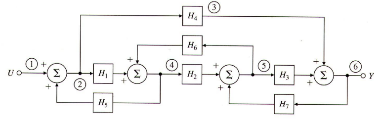

## Example 3.2

$$
\begin{gather}
\Delta = 1 - (H_1H_5 + H_2H_6 + H_3H_7 + H_4H_7H_6H_5) + H_1H_5H_3H_7
\end{gather}
$$

forward path:

$$
\begin{gather}
G_1 = H_1H_2H_3
\\\\
\Delta_1 = 1 - 0
\\\\\\
G_2 = H_4
\\\\
\Delta_2 = 1-(H_2H_6)
\end{gather}
$$

---
