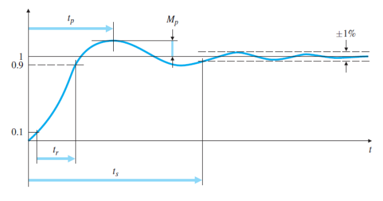
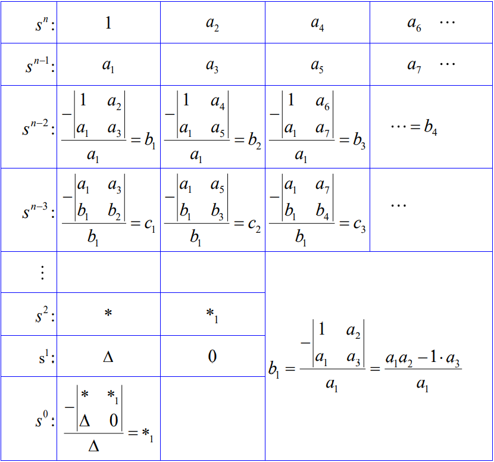

## DC Motor

- emf voltage: $e$
- armature current: $i_a$
- viscous friction coefficient: $b$
- inertia: $J_m$

$$
\begin{gather}
\tau = K_t\ i_a
\\\\
e = K_e\ \dot\theta_m
\\\\
K_t = K_e \ (\text{for same unit})
\end{gather}
$$

- Modeling
	- voltage across motor: $v_a$

$$
\begin{gather}
\tau = J_m\ddot\theta + b\dot \theta = K_t\ i_a
\\\\
v_a = L_a\ i_a' + r_a i_a + K_e\ \dot\theta_m
\end{gather}
$$

---

## Mason's Rule

$$
\begin{gather}
G(s) = \frac{V(s)}{U(s)}= \frac{\sum_i{G_i\ \Delta_i}}{\Delta}
\end{gather}
$$

$$
\begin{align}
\Delta = 1  &- \text{sum of all individual loop gains}
\\\\
&+ \text{sum of gain products of all possible two loops which do not touch}
\\\\
&- \text{sum of gain products of all possible three loops which do not touch}
\\\\
&+ \dots
\end{align}
$$

- path gain of the $i$th forward path $G_i$ 
- value of $\Delta$ for the part of the signal-flow graph that does not touch the $i$th forward path.

- see [example](examples/masion_rule_examples.md).

---

## Second System Response

### Transfer function

$$
\begin{gather}
H(s) = \frac{w_{n}^{2}}{s^{2}+2\zeta \omega_n s + \omega_n^{2}}
\end{gather}
$$

- Poles:
	- $\sigma = \zeta \omega_n$
	- $\omega_d = \omega_n\sqrt{1-\zeta^{2}}$

$$
\begin{gather}
s = - \zeta \omega_n \pm j \omega_n\sqrt{1-\zeta^{2}} = -\sigma \pm j\omega_d
\end{gather}
$$

---

### Unit Step Input

$$
\begin{gather}
Y(s) = \frac{1}{s}H(s) = \frac{1}{s} - \frac{s+2\zeta \omega_n}{s^{2}+2\zeta \omega_n s + \omega_n^{2}}
\end{gather}
$$

after some trivial calculation, 

$$
\begin{gather}
y(t) = 1 - K\ e^{-\sigma t}\ \sin(\omega_dt + \theta)
\end{gather}
$$

note that $K$ is not important.

---

### Peak Time
- peak Time $t_p$

$$
\begin{align}
y' &= 0
\\\\
y' &= K' e^{-\sigma t}\sin(\omega_d t)
\end{align}
$$

### Max Overshoot
max overshoot happens at $\omega_d \ t_p = \pi$

$$
\begin{gather}
t_p = \frac{\pi}{\omega_d}
\end{gather}
$$

- overshoot $M_p$ (memorize directly)

$$
\begin{align}
y(t_p) &= 1 + M_p
\\\\
&= 1 + e^{-\sigma\pi/\omega_d}
\end{align}
$$

$$
\begin{gather}
\implies M_p = e^{-\sigma\pi/\omega_d} = e^{-\sigma\, t_p}
\end{gather}
$$

---

### rise time
- $t_r \equiv t_2 - t1$
- for characteristic equation: $s+1/\tau$

$$
\left\{
\begin{gather}
e^{-t_1/\tau}=0.9
\\\\
e^{-t_2/\tau}=0.1
\end{gather}\right.
$$

$$
\begin{gather}
t_r=t_2-t_1=\tau(-\ln0.1-(-\ln0.9))=\tau\ln9\approx2\tau
\end{gather}
$$

- for characteristic equation: $s^{2}+2\zeta \omega_n+\omega_n^{2}$

$$
\begin{align}
t_r &\approx \frac{1.8}{\omega_n}
\\\\
&\approx \frac{0.8+1.1\zeta+1.4 \zeta^{2}}{\omega_n}
\end{align}
$$

### settling time
-  $t_s$ (for steady state error 1%)

- for characteristic equation: $s+1/\tau$

$$
\begin{gather}
e^{-t_s/\tau} = 0.01
\\\\
\implies -t_s/\tau = \ln0.01
\\\\
t_s = -\ln 0.01 \tau \approx 4.6 \tau
\end{gather}
$$

- for characteristic equation: $s^{2}+2\zeta \omega_n+\omega_n^{2}=(s-(\sigma+j\omega_d))(s-(\sigma-j\omega_d))$

$$
\begin{gather}
t_s = -\frac{\ln 0.01}{\sigma}
\end{gather}
$$

---

### Extra zero

$$
\begin{gather}
H(s) = K\frac{s+\alpha\sigma}{(s+(\sigma+j\omega_d))(s+(\sigma-j\omega_d))}
\end{gather}
$$

when $\alpha$ is small ($\alpha <4$), the extra zero would increase the overshoot $M_p$.

when $\alpha \to \infty$, zero would be trivial.

### Extra pole

$$
\begin{gather}
H(s) = K\frac{1}{(s+\alpha \sigma)(s+(\sigma+j\omega_d))(s+(\sigma-j\omega_d))}
\end{gather}
$$

when $\alpha$ is small ($\alpha < 4$), the extra pole decrease the rising time $t_r$.

when $\alpha \to \infty$, the extra pole is trivial.

---
## Final Value Theorem
- poles have to be on left-half plane (converge)

$$
\begin{gather}
y(\infty) = \left[sY(s)\right]_{s\to 0}
\end{gather}
$$

proof:

$$
\begin{gather}
L\left\{y'\right\}_{s\to0} =\left[sY(s)-y(0)\right]_{s\to 0}= \int_0^{\infty}{e^{-st}y' dt} = \int_0^{\infty}{y'dt} = y(\infty) - y(0)
\\\\
\implies \left[sY(s)\right]_{s\to0} = y(\infty)
\end{gather}
$$

- Initial value theorem
 

$$
\begin{gather}
\left[sF(s)\right]_{s\to \infty} = f(0^+)
\\\\
\end{gather}
$$

proof is similar to final value theorem.

## Routh-Hurwitz stability criterion

$$
\begin{gather}
s^{n} + a_1 s^{n-1} + a_2 s^{n-2} +\dots + a_{n-1}s +a_n=0
\end{gather}
$$

The system would be **stable** *iff* the elements of the first column ($a_1, b_1, c_1, \dots$) are all **positive**.

In addition, for a stable system, the coefficients of polynomial are all **positive** (not even $0$).

A simple explanation is that for a stable system which have its all roots at L.H.P, we can write

$$
\begin{gather}
(s+n_1)(s+n_2)(s+n_3)\dots \cdot (s+n_n)=0
\end{gather}
$$

---

- \# of roots in the RHP == # of sign changes in the first column.

???+ example "example 3.32"
    
    $$
    \begin{gather}
    a(s) = s^{6} + 4s^{5}+3s^{4}+2s^{3}+s^{2}+4s+4
    \end{gather}
    $$
    
    - first column
    
    | $s^{6}$ |   1    |
    |:-------:|:------:|
    | $s^{5}$ |   4    |
    | $s^{4}$ |  5/2   |
    | $s^{3}$ |   2    |
    | $s^{2}$ |   3    |
    | $s^{1}$ | -76/15 |
    | $s^{0}$ |   4    |
    
    There are two sign changes, $s^{2}$ to $s^{1}$, and $s^{1}$ to $s^{0}$.
    
    Thus, There are two roots in RHP
    

