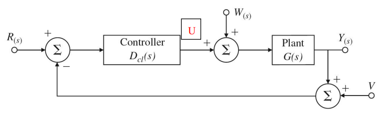
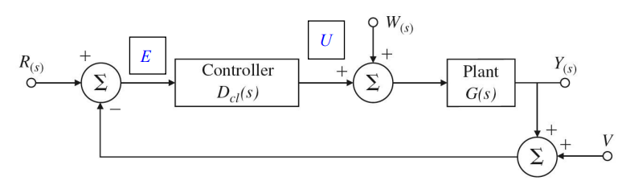
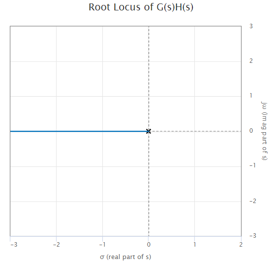
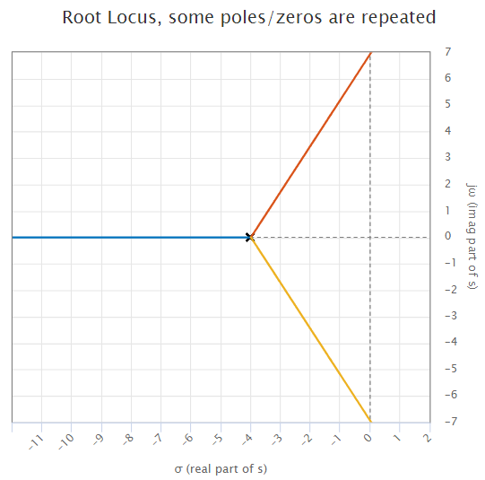

## Sensitivity

- sensitivity of transfer function $T$ w.r.t. its parameter $K$: $S_K^{T}$

$$
\begin{gather}
S_K^{T}=\frac{\frac{dT}{T}}{\frac{dK}{K}}=\frac{d\ln T}{d\ln K}=\frac{K}{T}\frac{dT}{dK}
\end{gather}
$$

---

## System Type for Tracking

### Reference Tracking

- Tracking definition 
	the output $Y(s)$ follow any reference input $R(s)$ as closely as possible.

$$
\begin{gather}
E = R - Y \to 0
\\\\
E(s) = R\left(1-\frac{DG}{1+DG}\right)=\frac{1}{1+DG}R
\end{gather}
$$

- System Classification
 
for type $k$, we have the input $R$ as 

$$
\begin{gather}
r(t)=\frac{1}{k!}t^{k} 1(t)
\iff
R(s)=\frac{1}{s^{k+1}}
\end{gather}
$$

 
such that

$$
\begin{gather}
e(\infty) = \text{const} \neq 0
\end{gather}
$$

---

- type $0$

$$
\begin{align}
e(\infty)&=
\bigg[s E(s)\bigg]_{s\to0}
\\\\
&=\bigg[s\frac{1}{1+DG}R(s)\bigg]_{s\to0}
\\\\
&=\bigg[s\frac{1}{1+DG}\frac{1}{s}\bigg]_{s\to0}
\\\\
&=\frac{1}{1+D(0)G(0)} = \frac{1}{1+K_p}
\end{align}
$$

- $K_p$ : position error constant

---

- type $1$

$$
\begin{align}
e(\infty)&=
\bigg[s E(s)\bigg]_{s\to0}
\\\\
&=\bigg[s\frac{1}{1+DG}R(s)\bigg]_{s\to0}
\\\\
&=\bigg[s\frac{1}{1+DG}\frac{1}{s^{2}}\bigg]_{s\to0}
\\\\
&=\bigg[\frac{1}{s+sDG}\bigg]_{s\to0}= \frac{1}{K_v}
\end{align}
$$

$$
\begin{gather}
\\\\
\implies D(s)G(s) = \frac{1}{s}J(s)
\\\\
\implies K_v = J(0)
\end{gather}
$$

- $K_v$ : velocity constant

---

- type $2$

$$
\begin{align}
e(\infty)&=
\bigg[s E(s)\bigg]_{s\to0}
\\\\
&=\bigg[s\frac{1}{1+DG}R(s)\bigg]_{s\to0}
\\\\
&=\bigg[s\frac{1}{1+DG}\frac{1}{s^{3}}\bigg]_{s\to0}
\\\\
&=\bigg[\frac{1}{s^{2}+s^{2}DG}\bigg]_{s\to0}= \frac{1}{K_a}
\end{align}
$$

$$
\begin{gather}
\\\\
\implies D(s)G(s) = \frac{1}{s^{2}}J(s)
\\\\
\implies K_a = J(0)
\end{gather}
$$

- $K_a$ : acceleration constant
---
### Disturbance Rejection

We hope to reject the disturbance $W(s)$. Thus, to determine the system type w.r.t. $W$, first ignoring the effect of $R$ by giving $R(s)=0$.

$$
\begin{gather}
E(s)=R-Y=-Y
\\\\
Y=\frac{G}{1+GD}W
\end{gather}
$$

then

$$
\begin{gather}
E(s)=\frac{-G}{1+GD}W
\end{gather}
$$

---
## PID Controller

- P (Proportional)
 

$$
\begin{gather}
D_{cl}(s)=\frac{U(s)}{E(s)}=k_p
\end{gather}
$$

### I (Integral)

$$
\begin{gather}
D_{cl}(s)=\frac{U(s)}{E(s)}=\frac{k_I}{s}
\end{gather}
$$

- fix steady-state error (with $K_I \neq 0$, $e_{ss}= 0$)

---

### D (Derivative)

$$
\begin{gather}
D_{cl}(s)=\frac{U(s)}{E(s)}=sk_D
\end{gather}
$$

- make the damping coefficient $\zeta\uparrow$, then the stability $\uparrow$, overshoot $\downarrow$
- has no effect on stead-state error
---

- PI (P + I)
 

$$
\begin{gather}
U(s)=E(s)k_P + \frac{k_I}{s}
\iff
u=k_Pe+k_I\int{e(\tau)\,d\tau}
\\\\
D_{cl}(s)=\frac{U(s)}{E(s)}=sk_D
\end{gather}
$$

---

## Root Locus

for the characteristic equation, all of these equations are equivalent.

$$
\begin{gather}
1+KL(s)=0
\\\\
1+K\frac{(s-z_1)(s-z_2)(s-z_3)\dots \cdot}{(s-p_1)(s-p_2)(s-p_3)\dots \cdot}=0
\\\\
\bigg((s-p_1)(s-p_2)\dots \cdot\bigg)+K\bigg((s-z_1)(s-z_2)\dots \cdot\bigg)=0
\\\\
\frac{1}{K}\bigg((s-p_1)(s-p_2)\dots \cdot\bigg)+\bigg((s-z_1)(s-z_2)\dots \cdot\bigg)=0
\end{gather}
\quad
\begin{aligned}
\text{(1)}
\\\\\\
\text{(2)}
\\\\\\
\text{(3)}
\\\\\\
\text{(4)}
\\\\
\end{aligned}
$$

- Rule 1: 
Find zeros and poles.
 
$K=0$, i.e. start of the root locus is located at the poles (observing (3))
 
$K=\infty$, i.e. end of the root locus is located at the zeros (observing (4))
- Rule 2:
Find the real axis positions of the locus.
 
Let $s=s_0$, for $s_0 \in ℝ$

$$
\begin{gather}
\angle L(s_0)=(\psi_{z1}+\psi_{z2}+\dots+)-(\phi_{p1}+\phi_{p2}+\dots +)=\pi,\, -\pi, \, 3\pi,\, -3\pi, \dots
\end{gather}
$$

if none of $s_0$ satisfy the equation above then the root locus is not on the real axis.
 
Otherwise, we can solve the range of $s_0$

- Rule 3:
Find the asymptotes for large $K$
 
When $K\to \infty$, there is not only the result show in Rule 1 ($s$ is finite)
 
Consider (2), for $K, s$ is large we can modify (2) as
 

$$
\begin{gather}
\left[1+K\frac{(s-z_1)(s-z_2)(s-z_3)\dots \cdot}{(s-p_1)(s-p_2)(s-p_3)\dots \cdot}\right]_{s\to\infty}=0
\\\\
\implies
1+K\frac{s^{(\text{\# of zeros})}}{s^{(\text{\# of poles})}}=0
\\\\
\implies
1+Ks^{m-n}=0
\\\\
\implies
s^{n-m}+K=0
\end{gather}
$$

- for $n-m = 0$,
 

$$
\begin{gather}
K\neq 0
\end{gather}
$$

In this case there is no asymptote. As Rule 1 says, all root go from poles to finite zeros.
  
- for $n-m =1$

$$
\begin{gather}
s=-K=-\infty
\end{gather}
$$

this indicates that there is an imaginary zero at $-\infty$.
 

- for $n-m > 1$

$$
\begin{gather}
s^{n-m}=-K = K\angle \pi
\\\\
\implies s= k \angle(\frac{\pi+ℓ\cdot2\pi}{n-m})
\\\\
k=K^{1/(n-m)}=\infty
\end{gather}
$$

e.g. $n-m=3$

$$
s= \left\{
\begin{gather}
&k\angle \frac{\pi}{3}
\\\\
k\angle \frac{3\pi}{3} = &k\angle\pi
\\\\
&k\angle \frac{-\pi}{3}
\end{gather}\right.
$$

note that this result only tell us there are three imaginary zeros at different directions of $\infty$.
 
However, the source (intersection) is no need to be at the origin ($s=0$).
This is because, for a finite $s_0 <0$.

$$
s_0 = m\angle\pi
\implies \left\{
\begin{gather}
(k\angle \frac{\pi}{3}-s_0)=k\angle \frac{\pi}{3}
\\\\
(k\angle \pi-s_0)=k\angle \pi
\\\\
(k\angle \frac{-\pi}{3}-s_0)=k\angle \frac{-\pi}{3}
\end{gather}\right.
$$

Thus we can write the asymptotes as
 

$$
\begin{gather}
\bigg((s-p_1)(s-p_2)\dots \cdot\bigg)+K\bigg((s-z_1)(s-z_2)\dots \cdot\bigg)=0
\\\\
\iff
\bigg(s^{n}+as^{n-1}+\dots+\bigg)+K\bigg(s^{m}+bs^{m-1}+\dots+\bigg)=0
\\\\
\implies \sum{p_i}=-a
\end{gather}
$$

$$
\begin{gather}
\bigg(s^{n}+as^{n-1}+\dots+\bigg)+K\bigg(s^{m}+bs^{m-1}+\dots+\bigg)=0
\\\\
\iff
s^{n}+as^{n-1}+\dots+K\bigg(s^{m}+bs^{m-1}+\dots+\bigg)=0
\\\\
\iff
(s-r_1)(s-r_2)\dots\cdot(s-r_n)=0
\\\\
\implies
\sum{r_i}=-a
\\\\
\implies
\sum{r_i}=-a=\sum{p_i}
\end{gather}
$$

now rewrite the characteristic equation

$$
\begin{gather}
\bigg[1+K\frac{(s-z_1)(s-z_2)(s-z_3)\dots \cdot}{(s-p_1)(s-p_2)(s-p_3)\dots \cdot}\bigg]_{s\to \infty}
\approx
1+K\frac{1}{(s-\alpha)^{n-m}}=0
\\\\
\implies
(s-\alpha)^{n-m}+K=0
\\\\
\iff
(s-r_1)(s-r_2)\dots\cdot(s-r_{n-m})=0
\\\\
\implies \sum_{i=1}^{n-m}{r_i}=-(-(n-m)\alpha)=(n-m)\alpha
\end{gather}
$$

notice that all of the roots go from poles to zeros, therefore for $n> m$ case, there are some poles go to infinite imaginary zeros.
 
Thus we have

$$
\begin{gather}
\sum(\text{all roots})=\sum(\text{roots go to finite zeros})+\sum{(\text{roots go to infinte img. zeros})}
\end{gather}
$$

$$
\begin{align}
\\
\implies \sum_{i=1}^{n}{r_i}&=\sum_{i=1}^{m}{z_i}+\sum_{i=m+1}^{n}{z_{img, i}}
\\\\
&= \sum{z_{i}}+(n-m)\alpha
\end{align}
$$

$$
\begin{gather}
\\
\implies
\alpha = \frac{\sum{r_i}-\sum{z_i}}{n-m}= \frac{\sum{p_i}-\sum{z_i}}{n-m}
\end{gather}
$$

- Rule 4: departure and arrival angle
	- for departure angle take $s_0 \to p_i$ and solve $\angle L(s_0)=n\pi$
	- for departure angle take $s_0 \to z_i$ and solve $\angle L(s_0)=n\pi$

- Rule 5: points on Image($j\omega$) axis
 
similar to rule 2, just let $s_0 = j\omega_0$ and try to solve the characteristic equation.

- Rule 6: find breakaway points (location of multiple roots)
 
consider there is a multiple roots $r_1$ then we can write

$$
\begin{gather}
1+KL(s)=0
\\\\
\implies
a(s) + Kb(s) \equiv (s-r_1)^{p}(s-r_2)\cdot \dots \cdot = 0
\\\\
\frac{d}{ds}\bigg[a(s)+Kb(s)\bigg]_{s=r_1}=p(s-r_1)^{p-1}(s-r_2)\cdot \dots \cdot = 0
\end{gather}
$$

thus, by solving the equation

$$
\begin{gather}
\frac{d}{ds}\bigg[a(s)+Kb(s)\bigg]=0
\end{gather}
$$

we can probably find the breakaway point $r_1$.