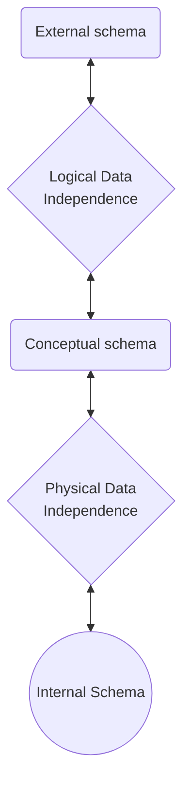

## Basic Definition

- Database &mdash; A collection of **related** data

- Data &mdash; Known facts that can be recorded and have implicit meaning.

- Mini-world &mdash; some part of the real world about which data is stored in a database.
	- For example, Part of a UNIVERSITY  environment.
		- `student`
		- `course`
		- `section`
		- `department`
		- and so on

- Database Management System
- Database System &mdash; DBMS + DATA

---

## Data Models

- Categories of data models
	- **Conceptual** (high level) &mdash; aka **entity-base** or **object-base** data models.
		- e.g. OO, ER, ...
	- **Physical** (low level) &mdash; Provide concepts that describe details of how data is stored in the device.
	
	- **Implementation** (record-oriented): Provide concept between conceptual and physical.
		- e.g. Relation, ...

---

## Three-Schema Architecture

- **Internal

----

## DBMS Languages

- **Data *Definition* Language (DDL)**
	- storage definition language (SDL)
	- view definition language (VDL)
- **Data *Manipulation* Language** (DML)
	- e.g. SQL

## Entity-Relationship Data Model

- Entity-Relationship aka **ER**

### Concepts

- Entities
- Attributes
	- simple
	- composite
	- multi-valued
- 

----

## Relational Algebra

- `SELECT` $\sigma$
- `PROJECTION` $\pi$
- `RENAME` $\rho$
- `DIVISION`  

### Set Operations

- `THETA JOIN` $\bowtie_\theta$
	- $\theta$ is comparison operators, e.g. $=, >, \ge,\dots$
	
- AGGREGATE $ℑ$ &mdash;  SUM, COUNT, AVERAGE, MIN, MAX, ...

	- format: \<grouping attributes\> $ℑ$ \<function list\>(R)

	- eg1. R(AVGSAL) $\leftarrow$ $ℑ$AVERAGE SALARY (EMPLOYEE)
	- eg2. R(DNO, NUMIPMS, AVGSAL) $\leftarrow$ DNO $ℑ$ AVERAGE SALARY (EMPLOYEE)
	- in which DNO is the grouping attrs.
	
	
	
	
<!--- - `NATURAL JOIN` $*$, is equivalent to $R_1\bowtie_{a=a}R_2$, and notice that only attribute $a$ is joinable between $R_1$ and $R_2$ 
-->