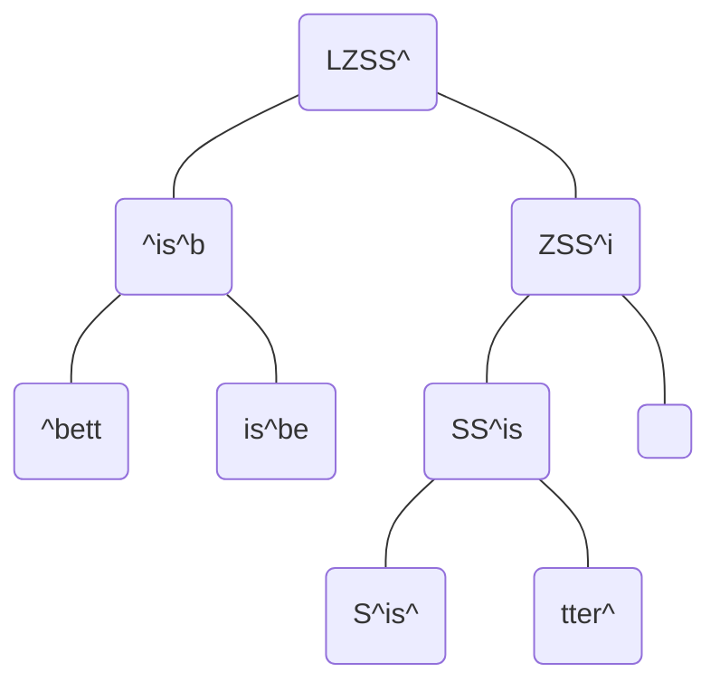
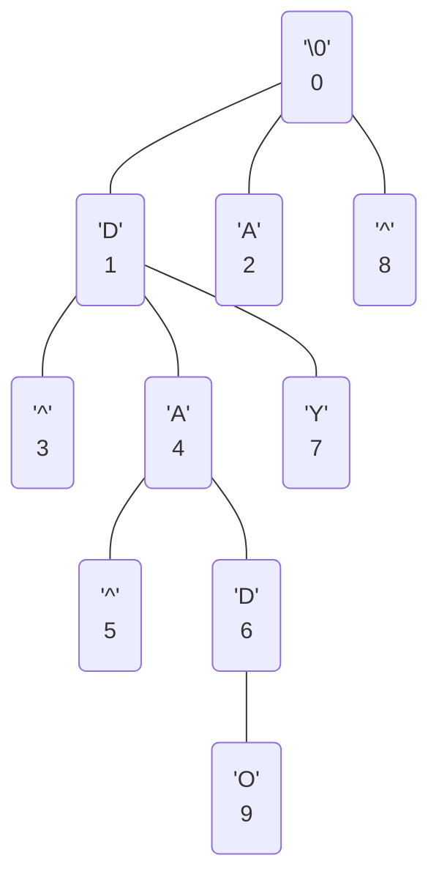

## Source Coding

- Shannon's Source Coding, 信源編碼、符號源編碼
- information mapping (bits, characters, ....)


---


## Entropy

### Self-Information

- by three assumptions
    1. $I(p) \ge 0$
    2. $I(p_1 \cdot p_2)=I(p_1) + I(p_2)$
    3. $I(p)$ is continuous to $p$

thus, gives $I(p) = -\log(p)$

- proof at p.25

### Entropy
Given,

$$
\begin{gather}
S=\{s_i \,|\, p(s_i) = p_i\}
\end{gather}
$$

then,

$$
\begin{gather}
H_r(S) = \sum\limits p_i I(s_i)=\sum\limits -p_i\log_r(p_i)
\end{gather}
$$

- note that $r$ is the base of log

### Gibbs' Inequality

$$
\begin{gather}
\sum\limits - p_i\log(p_i) \le \sum\limits-p_i\log(q_i)
\end{gather}
$$

- the lower bound of cross entropy of $q_i$ and $p_i$ are $H(p_i)$.

---

## Unique Decodable & Instantaneous Code

- p32

### Unique Decodable


- not unique decodable example

$$
\begin{gather}
(s_1, s_2, s_3, s_4) = (0, 01, 11, 00)
\end{gather}
$$

then for the message $0011$ could be decoded as

$$
0011 = \left\{
\begin{align}
&s_4s_3
\\
&s_1s_1s_3
\end{align}\right.
$$

### Instantaneous Code

- instantaneous *iff* 沒有一個符號是另一個符號的字首
- instantaneous &Rightarrow; unique
- the lengths of codes have to follow *Kraft Inequality*

#### Kraft Inequality

- If instantaneous, then the code have to end at leaves.<br>
thus, considering binary case only first we cannot build a binary tree for many short path(short coding length).<br>
Therefore, in order to build an binary tree, we must follow

$$
\begin{gather}
\sum\limits \frac{1}{2^{L_i}} \le 1
\end{gather}
$$

- intuitive thinking &ndash; Considering taking a branch of binary tree  have prob. 0.5 and 0.5, then the summation of prob. of all leaves is $1$.

- intuitively, the lowest bound of average lengths of codes is its entropy. (proof at p36.)

$$
\begin{gather}
H_r(S) \le L_{avg}
\end{gather}
$$

---

## Shannon-Fano Coding

- Since we know the lower bound of coding length is its entropy, then we can have the coding length (known as *Shannon-Fano Length*) as

$$
\begin{gather}
-\log(p_i)\le ℓ_i < -\log(p_i) + 1
\\\\
\iff
ℓ_i = \bigg\lceil -\log(p_i) \bigg\rceil
\end{gather}
$$

- drawback example<br>
Given $S=\{s_1, s_2\}$, and $k$ is large

$$
\begin{gather}
p_1 = 2^{-k}, \qquad p_2=1-p_1
\\\\
\implies l_1 = k, \qquad l_2=1
\end{gather}
$$

- in Huffman coding, both $l_1, l_2 = 1$, but since $p_1$ is small when $k$ is large, this drawback isn't very critical.

---
## Extension Code

- quick concept &ndash; if we have an source code $S$, then we can define an new source code $T = S^{n}$ (then the \# of symbol in $T$ would be $|S|^{n}$) 
- The $H(T) = nH(S)$, and denote $L_n$(average length of $n$-order S.F. code), then

$$
\begin{gather}
H(T) \le L_n < H(T) + 1
\\\\
H(S) \le \frac{L_n}{n} < H(S) + \frac{1}{n}
\end{gather}
$$

thus when $n\to \infty$, then $\frac{L_n}{n} \to H(S)$
<br>
aka Shannon's noiseless coding theorem.

## Adaptive Huffman

1. start with one EOF and one ESC (always one in Huffman tree).
2. EOF &ndash; send when end of file.
3. ESC &ndash; send when new symbol is added to tree (send following with ascii of that symbol so that decoder can know what to decode).

## JBIG & JBIG2

- code for binary data directly ($S \in \{0, 1\}$)

- *JBIG* &ndash; high order adaptive arithmetic (for $P(s_t \,|\, s_{(t-n):(t-1)})$.
    - since the target is binary, the high order coding table would be $2^{n}$, much less than high order Huffman.
- *JBIG2* &ndash; Define decoding protocol only. That is the encoder side can be any algorithm, even lossy.

## LZ

### LZ77

- **sliding window** and **look-ahead buffer**
- find phrase in window, and encode text in look-ahead buffer
- send `(displacement, length, next_char)`
- in no match case, send `(0, 0, next_char)`
- pros
    - fast decode
- cons
    - slow encode
        - $O(n)$, ($n$ is windows size)
        - $O(m)$, ($m$ is look-ahead buffer size)
    - worst case when no match
    - prefer larger window size but cost too much
        - time efficiency &downarrow;
        - compressed phrases size &uparrow;
    - loss memory (after dictionary is full of phrases, some of them have to be removed)

### LZSS

- improving version of LZ77
- send $1$ bit indicating whether is no match instead of send `(0, 0 next_char)`
- 
- Circular queue with WINDOW_SIZE = $2^{n}$
- Binary Search Tree for storing phrases (actually storing pointer to particular position of window).
    - Node stores fixed-size length
    - e.g. (*"LZSS is better than LZ77"*) with fixed length $5$, (search by comparing char-wise order)
    


### LZ78

- create new phrase in dictionary at both encoder size and decoder size whenever no match
    1. initially, there is only null string in dictionary.
    2. thus whenever create a new phrase with length $n$, there must exists a phrase with length $n-1$.
    3. therefore, using **multiway search tree** to store phrases


- in this case `p1 = D`, `p3 = D^`, `p5=DA^`, and so on...

- example at p119
    - thus encoder side only have to send phrase code (phrase id), without phrase's length.
        - i.e. `(phrase_id, next_char)`
- cons
    - slow decoding (have to maintain dictionary tree)

### LZW

- improving version LZ78
    - defined every characters as phrases first, then send only `(phrase_id, )`
- examples: PNG, ...
- algorithm p122
    - encoder:
    ```cs
    i := 0;
    Dictionary phrases;
    string in_buff;
    in_buff.Add(str[i])
    
    while
        in_buff.Add(str[++i])
        if in_buff not in phrases
            phrases.Add(in_buff)
            OUTPUT << phrases.IndexOf(in_buff.PopLast())
            in_buff := string(in_buff[-1])
        
    ```
    - decoder
    ```cs
    i := 0
    Dictionary phrases;
    int in_buff;
    string last_phrase
    
    // init
    INPUT >> in_buff
    last_phrase := phrases[in_buff]
    OUTPUT << last_phrase
    
    while true
        INPUT >> in_buff
        OUTPUT << phrases[in_buff]
        phrases.Add(last_phrase + phrases[in_buff][0])
        last_phrase = phrase[in_buff]
    ```


---

## Lossy

- RMSE (Root Mean Square Error)
- SNR (Signal-to-Noise Ratio)
    
    $$
    \begin{gather}
    \text{SNR}
    = \frac{E\big[S^{2}\big]}{E\big[(X-\mu)^{2}\big]}
    = \frac{E\big[S^{2}\big]}{\sigma_r^{2}}
    \\\\
    \text{SNR}_{dB}
    = 10\log_{10}{\text{SNR}}
    \end{gather}
    $$
    
    - in 2d media case

$$
\begin{gather}
\text{SNR} = \frac{Q^{2}}{\sigma_r^{2}}
\end{gather}
$$

in which $Q = 255$ in 8-bits case.


## DM

- Delta Modulation
- Adaptive DM (ADM)
    - adaptive for the magnitude of $\Delta$

## DPCM

- Differential Pulse Code Modulation

### Predictor Optimization

- objective

$$
\begin{align}
\hat x_{m}^*
&= \arg\min_{\hat x_m} \,\sigma_e^{2}
\\\\
&= \arg\min_{\hat x_m} E\bigg[(x_m - {\hat x_m})^{2}\bigg]
\end{align}
$$

in which, 

$$
\begin{gather}
\hat x_m = \sum\limits_{i \in [0, m)}{\alpha_i}x_i
\end{gather}
$$

then solve by differentiation, we have

$$
\begin{gather}
E\big[(x_m-\hat x_m)x_i\big] = 0
\end{gather}
$$

thus

$$
\begin{gather}
E[x_mx_i] = E[\hat x_m x_i]
\\\\
R_{mi} = E[\hat x_m x_i]
\end{gather}
$$

and further when $i=m$,

$$
\begin{gather}
E\left[x_m^{2}\right]=E\left[\hat x_m x_m\right]
\\\\
\implies
\sigma_e^{2} = E\bigg[(x_m -\hat x_m)^{2}\bigg]=
\\\\
E\big[(x_m-\hat x_m)\hat x_m\big]=E\big[x_m^{2}\big] - E\big[\hat x_m^{2}\big]
\\\\
\implies \sigma^{2} < E\big[x_m^{2}\big]
\end{gather}
$$

- p141

### Quantizer Optimization

- objective ($N$ is number of order of quantizer)

$$
\begin{gather}
D=\sum\limits_{i \in [0, N)}{\int_{d_i}^{d_{i+1}}p(e)\,(e-r_i)^{2}de}
\end{gather}
$$

- p143

### Adaptive DPCM (ADPCM)

- 映射量化器
    - $e=x_m - \hat x_m$
    - $x_m \in [0, 2^{n})$, thus normally $e \in(-2^{n}, 2^{n})$
    - however with known $\hat x_m$, then $e \in [-\hat x_m,\, 2^{n} - \hat x_m)$
- 替換量化器
    - use multi quantizers, and encode with the best quantizer, and send which of quantizers.

### Lossless DPCM

- without quantizers, send the $e$ directly (or further using other lossless algorithm).
- thus can be used as preprocessor for others like *Huffman*, *Arith*. (since quite popular).
- more efficient then using adaptive like *AHuff*, *AArith*, but perform closely.

---

## Non-Redundant Sample Coding

- aka adaptive sampling coding

### Polynomial Predictor

$$
\begin{gather}
x_t = x_{t-1} + \Delta x_{t-1}+\Delta^{2}x_{t-1}+\cdots
\end{gather}
$$

in which

$$
\begin{gather}
\Delta^{2}x_{t-1} = \Delta x_{t-1} - \Delta x_{t-2}
\end{gather}
$$

### Polynomial Interpolator

- 1次內插法 = 扇形演算法 = SAPA2

### AZTEC

- p173
- rules
    1. use horizontal line if $\ge 3$ successive samples satisfy $x_{max} - x_{min} < \lambda$
    2.  otherwise, use slope. Further, if next sample have the same signed of slope and $|x_m - x_{m-1}| > \lambda$, then keep redundant.

### CORNER

- CORCER > SAPA2 > AZTEC
- algorithm
    1. 2-order diff, $x''(i)=x(i+1)+x(i-1)-2x(i)$
    2. $\forall i$, if $x(i) > \lambda_1$ and $x''(i)$ is local maximum, then make $x(i)$
    3. then now have redundant samples $x(m_1), x(m_2), x(m_3), \dots$
    3. for all redundant, find if $x\left(\frac{m_1+m_2}{2}\right)- \frac{x(m_1)+x(m_2)}{2} > \lambda_2$ (that is, if the $x$ very concave (凹))
    5. if not, add $x(\frac{m_1 + m_2}{2})$, as $x(m_{1\_2})$ , and do $\big\{x(m_1)$, $x(m_{1\_2})\big\}$ and $\big\{x(m_{1\_2}), x(m_2)\big\}$ as step 4.
    6. if step4. so, continue
    
---

## BTC

-Block Truncation Coding

### Moment-Preserving Quantizer

- target &ndash; find quantizer that make 1st and 2nd moment unchanged, and since
    
    $$
    \begin{gather}
    \sigma^{2} = E\big[X^{2}\big] - E\big[X\big]^{2}
    \end{gather}
    $$
    
    the variance $\sigma^{2}$ would also unchanged.

- solution &ndash; Given $X_{th}$ as the threshold (normally, mean of all pixels), and $q$ is \# of $b$ cases

$$
\hat x_i = 
\begin{dcases*}
a & if $x_i < X_{th}$
\\\\
b & otherwise
\end{dcases*}
$$


$$
\begin{align}
\\
E\big[X\big]&=\frac{(m-q)\cdot b+q\cdot a}{m}
\\\\
E\big[X^{2}\big]&=\frac{(m-q)\cdot b^{2} + q\cdot a^{2}}{m}
\end{align}
$$

then,

$$
\begin{align}
a &= E\big[X\big] - \sigma \sqrt{\frac{q}{m-q}}
\\\\
a &= E\big[X\big] + \sigma \sqrt{\frac{m-q}{q}}
\end{align}
$$

- solution2 (Absolute Moment BTC, AMBTC)
    - since the square root is hard to compute, thus we maintain the absolute moment instead of 2nd moment.
    
    $$
    \begin{gather}
    \alpha=E\bigg[|X_i - \mu|\bigg]
    \end{gather}
    $$
    
    then, we can have,
    
    $$
    \begin{align}
    a &= E[X] - \frac{m\alpha}{2(m-q)}
    \\\\
    b &= E[X] + \frac{m\alpha}{2q}
    \end{align}
$$

---

## Transform Coding

- Rotation Matrix

$$
M(\theta) = 
\begin{bmatrix}
\cos\theta & -\sin \theta
\\
\sin\theta & \cos \theta
\end{bmatrix}
$$


 ### Zonal Sampling
- 區域取樣
    1. 保留低頻，高頻通常小，不留
    2. 低頻用比較多 bits
    3. 固定 bits per block 但讓 variance 大(對其他 blocks 的同位置)的係數有比較多 bits
- cons
    - 可能有很大難以忽略的係數
### Threshold Sampling

- 臨界取樣
    1. 設 threshold ，以下為 0，以上送位置與值

### JPEG encode

1. get $F^{*}(u, v)$
2. scan with z order
3. First coefficient(DC) encode with DPCM and Huffman.
4. encode remains coefficients(AC) with the following law
    1. omit $0$
    2. lookup category $k$ at p220
    3. according to category $k$ and \# of $0$ before this coefficient, lookup table in p224.
    4. append $k$ bits which indicates the index of AC coefficient in that category.

### DCT

- p209

---

## Vector Quantization

- Cost of encoding $O(nN_c)$, where $n$ is dimension of vector, $N_c$ is number of codebooks.
- need memory $n N_c$

### LBG

LBG演算法是由Linde,Buzo,Gray三人在1980年提出的。其算法與K-means雷同，根據當前劃分之群集計算誤差量，不斷調整映射區間(Mapping Region)及量化向量之量化點:

1.  給定訓練樣本以及誤差閾值
2.  訂定初始碼向量
3.  將疊代計數器歸零
4.  計算總誤差值，若不為第一次，則檢查與前一次誤差值差距是否小於閾值。
5.  根據每一個訓練樣本與碼向量的距離d，找其最小值，定義為映射函數Q
6.  更新碼向量：將對應到同一個碼向量的全數訓練樣本做平均以更新碼向量。


i為疊代計數器，C為該群集之代表，x為資料點，Q(x)為x量化後之群集代表C

7. 疊代計數器加一

8. 會到步驟四，直至誤差值小於閥值

LBG演算法十分依賴起始編碼簿，產生起始編碼簿的方法有以下幾種：

### Tree-Structured Codebooks
- $m$-ways tree
- Cost now decrease to $O(n \cdot m\log_m{N_c})$
- Memory increase to $n m \frac{N_c - 1}{m - 1}$
    - Because there are $N_n=(m + m^{2} + m^{3} +\cdots)$ nodes,<br>and that $N_n = m\frac{m^{\log_m N_c} -1}{m-1}=m\frac{N_c - 1}{m-1}$ 
- cons
    - perform worse then full-search, since taking branch.

### Product Code

- use codebook represent vector direction with size $N_1$, and codebooks represent vector length with size $N_2$.
    - this case, we can represent $N_1 N_2$ vectors with only size $N_1 + N_2$
        - therefore, in same time complexity and bit rate, perform better the full-search

### M/RVQ

- 平均/餘值 VQ
    1. 對每個 blocks (e.g. $n=4\times 4=16$) 減去平均
    2. 傳送平均 (with DPCM or something)
    3. do VQ and send

### I/RVQ

- 內插/餘值 VQ
    1. do subsampling to **original** image (assume $N\times N$) and would get sub-image ($N/ℓ \times N/ℓ$, normally $ℓ=8$).
    2. do up-sampling by interpolation, and get the residual image.
    3. split residual image to blocks and do VQ.
- pros
    - perform better (less blocking artifacts) than M/RVQ.

### G/SVQ

- Gain/Shape VQ
    - find and send the vector that match the most (has greatest dot product value)


### CVQ

- Classification VQ
    1. split the image to blocks
    2. classify blocks to categories
    3. for every categories, there are some specific codebooks
- normally use many small codebooks, but can reach similar performance with the normal VQ using large codebooks.


### FSVQ

- Finite State VQ
    1. Given
        - codebooks per state $C(s_i)$
        - transition function $s_i = f(s_{i-1}, Y_{i-1})$
    1. given $s_0$, and find $Y_0$ by $C(s_0)$
    3. get $s_1 = f(s_0, Y_0)$, and find $Y_1$
    4. until all done

- cons
    - one connection drop can cause serious consequence.