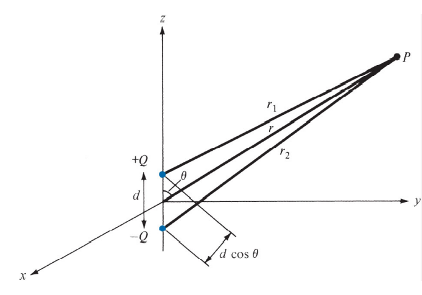

## Gauss's Law

$$
\begin{gather}
\Phi = Q_{enc}
\\\\
\Phi = \oint_S{\vec D \  \cdot\ d\vec S} = \int_v{ \nabla \cdot \vec D\ dv} = \int_v{\rho_v \ dv} 
\\\\
\nabla \cdot \vec D = \rho_v
\end{gather}
$$

---
## Electric Field

### Electric dipole

- Dipole moment: $\vec p$

$$
\begin{gather}
\vec p = Q\vec d
\\\\
V = \frac{Q}{4\pi \varepsilon}\cdot \frac{d \cos\theta}{r^{2}} = \frac{\vec p \cdot \hat {a_r}}{4\pi \varepsilon r^{2}}= \frac{\vec p \cdot \vec {r}}{4\pi \varepsilon r^{3}}
\\\\
\end{gather}
$$

note that $\hat{a_r}$ is unit vector.

$$
\begin{align}
\vec E &= -\nabla V
\\\\
&= -  \left[\frac{\partial V}{\partial r} \hat r \ +\frac{1}{r}\frac{\partial V}{\partial \theta}\hat \theta \ \right]
\\\\
&= \frac{p}{4\pi  \varepsilon r^3}(2\cos \theta \ \hat r\ + \sin\theta\ \hat \theta\ )
\end{align}
$$

---

### Polarization

- Polarization vector: $\vec P$

$$
\begin{gather}
\vec P \equiv \chi_e  \ \varepsilon_0\ \vec E
\end{gather}
$$

- surface bound charge density: $\rho_{ps}$
	- the direction $\hat {a_n}$ is outgoing the volume which contain charge

$$
\begin{gather}
\rho_{ps} = \vec P \cdot \vec{a_n}
\end{gather}
$$

- volume bound charge density: $\rho_{pv}$

$$
\begin{gather}
\rho_{pv} = -\nabla \cdot \vec P
\end{gather}
$$

- Electric flux density field $D$

$$
\begin{align}
\rho_v &= \rho_{\text{total}}-\rho_{pv}
\\\\
\implies \nabla \cdot \vec D &= \nabla \cdot \left(\varepsilon_0\vec E \right) - (- \nabla \cdot \vec P)
\\\\
\implies
\vec D &= \varepsilon_0\ \vec E + \vec P
\\\\
&= \varepsilon_0 (1 + \chi_e) \vec E
\\\\
&= \varepsilon_r\ \varepsilon_0\ \vec E
\\\\
&= \varepsilon\ \vec E
\end{align}
$$

---

## Electric Potential

$$
\begin{align}
V_{AB} &= -\int_A^{B}{\vec E \ \cdot\ d\vec l}=V_B - V_A
\\\\
&= \int_A^{B}{dV}=\int_A^{B}{ \vec\nabla V \cdot d \vec l}
\end{align}
$$

implies, 

$$
\begin{gather}
\vec E = - \nabla V
\\\\
\end{gather}
$$

- by Stokes' Theorem

$$
\begin{gather}
\oint_L{\vec E \cdot d \vec l = \int_S (\nabla \times \vec E)\cdot d \vec S} = 0
\\\\
\implies \nabla \times \vec E =0
\end{gather}
$$

---

## Electric Energy

- $W_E$ : Energy stored in the capacitor

- discrete charges

$$
\begin{gather}
W_E = \frac{1}{2}\sum{Q_k V_k}
\end{gather}
$$

- continuous charges

$$
\begin{align}
W_E &= \int_v{\rho_v V(\vec r) dv} 
\\\\
&=\frac{1}{2}\int_v{(\nabla \cdot \vec D)V \ dv} = \frac{1}{2}\left(\int_v{\nabla \cdot (\vec D \,V)\ dv}-\int_v{\vec D \cdot (\nabla V)\ dv} \right)
\\\\
&= \frac{1}{2}\left(\oint_S{V\vec D\ \cdot d\vec S} + \int_v{\vec D \cdot \vec E\ dv}\right)
\end{align}
$$

consider $S = U$ (Universe), then

$$
\begin{gather}
\oint_S{V\vec D\ \cdot d\vec S} \to 0 
\\\\
\implies W_E = \frac{1}{2}\int_U{\vec D\cdot \vec E \ dv}
\end{gather}
$$

---

## Conduction Current
- Definition: Charge flows due to $\vec E$

- force on electron $F_e$

$$
\begin{gather}
\vec F_e = -e\vec E
\end{gather}
$$

- friction $F_r$

$$
\begin{gather}
\vec F_r = \frac{\Delta p}{\Delta t} =- \frac{m\vec u}{\tau}
\end{gather}
$$

$$
\begin{gather}
\vec F_e + \vec F_r = 0
\\\\
\implies \frac{m\vec u}{\tau} = -e \vec E
\end{gather}
$$

- mean free time $\tau$
- average drift velocity $\vec u$

$$
\begin{gather}
\vec u = - \frac{e\tau}{m}\vec E = -\mu_e \vec E
\end{gather}
$$

---

## Current Density

- current view:

$$
\begin{gather}
\vec J = \frac{\partial I}{\partial \vec S}
\end{gather}
$$

- convection current view:

$$
\begin{gather}
\vec J = \rho_v \vec u=(-ne)\left(-\frac{e\tau}{m}\right)\vec E
\end{gather}
$$

- Ohm's law view:

$$
\begin{gather}
\because I = YV
\\\\
\vec J = \sigma \vec E
\end{gather}
$$

- conductivity $\sigma$

---
### Continuity Equation

$$
\begin{gather}
I_{net} = -\frac{d}{dt}Q = -\frac{d}{dt}\int_v{\rho_v\, dv}
\\\\
I_{net} = \oint_S{\vec J \cdot \vec S} = \int_v{\nabla \cdot \vec J\, dv}
\\\\
\implies \nabla \cdot \vec J = - \frac{d}{dt}\rho_v
\end{gather}
$$

???+ note "note"
    collapse: true
    
    Recall that the physical meaning of divergence,
    
    $$
    \begin{gather}
    \nabla \cdot \vec A 0 & \text{(source)}
    \\\\
    \nabla \cdot \vec A < 0 & \text{(sink)}
    \end{gather}
    $$
    
    It is reasonable to write $\mathbf{-}\rho_v'$ for a charge source.
    
    Also intuitive for steady current have
    
    $$
    \begin{gather}
    \nabla \cdot \vec J = 0
    \end{gather}
    $$

---
### Relaxation Time
- relaxation time $\tau$
- view from solving differential equation

$$
\begin{gather}
\nabla \cdot \vec J = -\frac{d}{dt}\rho_v = \nabla \cdot (\sigma \vec E) = \frac{\sigma}{\varepsilon}\nabla \cdot \vec D = \frac{\sigma}{\varepsilon}\rho_v
\\\\
-\frac{\sigma}{\varepsilon} dt  = \frac{d\rho_v}{\rho_v}
\\\\
\implies \rho_v = \rho_{o}\exp\left(-\frac{\sigma}{\varepsilon}t\right) = \rho_o e^{-t/\tau}
\\\\
\implies \tau = \frac{\varepsilon}{\sigma}
\end{gather}
$$

- view from having $\tau = RC$

$$
\begin{gather}
\tau = RC = \frac{V}{I}\frac{Q}{V}=\frac{\int{\varepsilon\vec E \cdot d\vec S}}{\int{\sigma\vec E\cdot d\vec S}}=\frac{\varepsilon}{\sigma}
\end{gather}
$$

---

## Boundary Condition

for there is no surface charge density

$$
\begin{gather}
\nabla \cdot (\rho_S \,\vec{a_n})=0
\\\\
\implies
\nabla \cdot \vec D=0
\\\\
\vec J=\sigma\vec E
\\\\
\implies \vec\nabla \cdot \vec J=0
\end{gather}
$$

implies

$$
\begin{gather}
D_{1n} = D_{2n}
\\\\
J_{1n}=J_{2n}
\end{gather}
$$

- tangent direction

for the closed-loop in conservative field, we have

$$
\begin{gather}
\because \oint_c{\vec E \cdot d\vec l}=0
\end{gather}
$$

then

$$
\begin{gather}
\vec E_1 = \vec E_2
\\\\
E_{1n} = E_{2n} =0
\\\\
\implies E_{1t} = E_{2t}
\end{gather}
$$

for $\vec J  = \sigma \vec E$

$$
\begin{gather}
\frac{J_{1t}}{\sigma_1}= \frac{J_{2t}}{\sigma_2}
\end{gather}
$$

---
