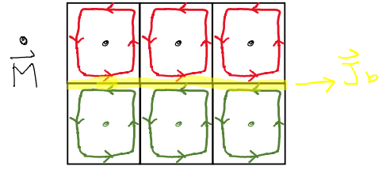

## Biot-Savart's Law

- Sources

$$
\begin{gather}
\vec udQ = \frac{d\vec ℓ}{dt}Q = Id\vec ℓ
\end{gather}
$$

- Magnetic flux density:

$$
\begin{gather}
d\vec B = \frac{\mu_o}{4\pi}\frac{Id\vec ℓ \times \hat{a_r}}{R^{2}}
\end{gather}
$$

- Magnetic field density:

$$
\begin{gather}
d\vec H = \frac{d\vec B}{\mu_o}= \frac{1}{4\pi}\frac{Id\vec ℓ \times \hat{a_r}}{R^{2}}
\end{gather}
$$

- Magnetic force

$$
\begin{align}
d\vec F &= 
Id\vec ℓ \times d\vec B
\\\\
&=
Id\vec ℓ \times \left(\frac{\mu_o}{4\pi}\frac{Id\vec ℓ \times \hat{a_r}}{R^{2}}\right)
\end{align}
$$

!!! note "Comparison"
    
    $$
    \begin{gather}
    d\vec F= q \vec E
    \end{gather}
    $$

---
## Ampere's Law

- original Ampere's law 👎

$$
\begin{gather}
\oint_C{\vec H \cdot d\vec ℓ}=\int_S{\vec J\cdot d\vec S}=I_{enc}
\\\\
\nabla \times \vec H=\vec J
\end{gather}
$$

- Ampere-Maxwell equation 👍

$$
\begin{gather}
\oint_C{\vec H \cdot d \vec ℓ} = \int_S{\left(\vec J_f+\frac{\partial \vec D}{\partial t}\right)\cdot d \vec S}
\\\\
\nabla \times \vec H =\vec J_f + \frac{\partial \vec D}{\partial t} 
\end{gather}
$$

???- note "displacement current"
    
    
    for the identity
    
    $$
    \begin{gather}
    \nabla \cdot (\nabla \times \vec H) =0
    \\\\
    \nabla \cdot (\nabla \times \vec H) = \nabla \cdot \vec J \neq 0 \quad\text{ when}\quad\nabla \cdot \vec J=-\frac{\partial \rho_v}{\partial t} \neq 0
    \end{gather}
    $$
    
    thus, let's write
    
    $$
    \begin{gather}
    \nabla \times \vec H = \vec J +\vec J_d
    \end{gather}
    $$
    
    then
    
    $$
    \begin{gather}
    \nabla \cdot (\nabla \times \vec H) = \nabla \cdot \vec J + \nabla \cdot \vec J_d= 0
    \\\\
    \implies \nabla \cdot \vec J_d  = \frac{\partial \rho_v}{\partial t} = \frac{\partial }{\partial t}\left(\nabla \cdot \vec D\right)
    \\\\
    \implies\vec J_d= \frac{\partial \vec D}{\partial t}
    \end{gather}
    $$
    
    - displacement current $I_d$
    <br
    $\vec J_d$ is called displacement current density, and the displacement current $I_d$ id defined by
    <br
    
    $$
    \begin{gather}
    I_d = \int_S{\vec J_d \cdot d\vec S}
    \end{gather}
    $$
    
    for $I_d \neq 0$ whenever there is an accumulation of charges, or the imginary current inside capacitor. 
    <br
    e.g. semi-infinite conductive wire.
    

---

## Gauss' Law

$$
\begin{gather}
\oint_S{\vec B \cdot d \vec S} = \int_V{\nabla \cdot \vec B}=0
\end{gather}
$$

For it exists **not** isolated magnetic poles, Guass' law here in magnetism is pretty intuitive.

---

## Faraday's law

- static electric field $E_e$
- transformer-induced electric field $E_T$
- motion-induced electric field $E_m$
- induced electric field $E_{ind} \equiv E_T +E_m$

$$
\begin{align}
V_{emf}&=\oint_L (E_e+E_T+E_m)
\\\\
&=0+\left(-\int_S{\frac{\partial \vec B}{\partial t}\cdot d\vec S}\right)+\oint_L{\left(\vec u \times \vec B\right)\cdot d\vec ℓ}
\\\\
&=-\frac{d}{dt}\int{\vec B \cdot d\vec S}
\end{align}
$$

- differential form

$$
\begin{gather}
\nabla \times \vec E=-\frac{\partial \vec B}{\partial t}+\nabla \times \left(\vec u \times \vec B\right)
\\\\
\iff
\nabla \times \left(\vec E- \vec u \times \vec B\right)=-\frac{\partial \vec B}{\partial t}
\end{gather}
$$

---

## Magnetic Potentials

### Magnetic Scalar Potential

- magnetic scalar potential $V_m$ (in $A$)

Ignoring displacement current $\vec J_d$, if $\vec J = 0$, then

$$
\begin{gather}
\nabla \times \vec H = 0
\\\\
\vec H = - \nabla V_m
\end{gather}
$$

!!! note "comparison"
    
    $$
    \begin{gather}
    \frac{1}{\varepsilon}\vec D = - \nabla V
    \end{gather}
    $$

### Magnetic Vector Potential

- magnetic vector potential $\vec A$ (Wb/m)

since 

$$
\begin{gather}
\nabla \cdot \vec B = 0
\end{gather}
$$

and recall the identity

$$
\begin{gather}
\nabla \cdot \nabla \times \vec A = 0
\end{gather}
$$

then we can write

$$
\begin{gather}
\vec B = \nabla \times \vec A
\end{gather}
$$

by Stokes' theorem

$$
\begin{gather}
\psi = \int_S{\vec B \cdot d \vec S}=\int_S{(\nabla \times \vec A)\cdot d\vec S}=\oint_L{\vec A\cdot d \vec ℓ}
\end{gather}
$$

and just remember that

$$
\begin{gather}
\vec A = \int_Q{\frac{\mu}{4\pi}\frac{\vec udq}{R}}
\end{gather}
$$

- line current

$$
\begin{gather}
\vec udq = I d\vec ℓ
\end{gather}
$$

- surface current

$$
\begin{gather}
\vec udq = \vec K dS
\end{gather}
$$

- volume current

$$
\begin{gather}
\vec udq = \vec J dv
\end{gather}
$$

!!! Note "Comparison"
    
    $$
    \begin{gather}
    V=\int_Q{\frac{1}{4\pi \varepsilon}\frac{dq}{R}}
    \end{gather}
    $$

---

### Time-Varying Potentials

???- note "Easy but tedious derivation"
    1. $\nabla \times \vec E$
    
    $$
    \begin{gather}
    \nabla \times \vec E = -\frac{\partial \left(\nabla \times \vec A\right)}{\partial t}=-\nabla \times \frac{\partial \vec A}{\partial t}
    \\\\
    \implies
    \nabla \times \left(\vec E + \frac{\partial \vec A }{\partial t}\right)=0
    \iff
    \nabla \times \left(-\nabla V\right)=0
    \\\\
    \implies \vec E = -\frac{\partial \vec A}{\partial t}-\nabla V
    \end{gather}
    $$
    
    1. $\nabla \cdot \vec D$
    
    $$
    \begin{gather}
    \nabla \cdot \vec E= \frac{\rho_v}{\varepsilon}
    \\\\
    \implies
    \nabla^{2}V  +\frac{\partial }{\partial t}\left(\nabla \cdot \vec A\right) =-\frac{\rho_v}{\varepsilon}
    \end{gather}
    $$
    
    1. $\nabla \times \vec H$
    
    $$
    \begin{gather}
    \nabla \times \vec H= \vec J + \varepsilon\frac{\partial \vec E}{\partial t}
    \\\\
    \nabla \times \left(\frac{\nabla \times A}{\mu}\right)= \vec J + \varepsilon\frac{\partial \vec E}{\partial t}
    \\\\
    \nabla^{2}\vec A=\nabla \left(\nabla \cdot \vec A\right)-\nabla \times \nabla \times \vec A
    \\\\
    \nabla^{2}\vec A = \nabla \left(\nabla \cdot \vec A\right)-\mu \vec J - \mu\varepsilon \frac{\partial \vec E}{\partial t}
    \\\\
    \nabla^{2}\vec A - \nabla \left(\nabla \cdot \vec A\right)=-\mu \vec J + \mu\varepsilon\nabla \left(\frac{\partial V}{\partial t}\right) +\mu\varepsilon \frac{\partial ^{2}\vec A}{\partial t^{2}}
    \end{gather}
    $$

1. coupled equations for $V$ and $\vec A$, (normally given $\rho_v$ and $\vec J$)

$$
\left\{
\begin{align}
&\nabla^{2}V  +\frac{\partial }{\partial t}\left(\nabla \cdot \vec A\right) =-\frac{\rho_v}{\varepsilon}
\\\\
&\nabla^{2}\vec A - \nabla \left(\nabla \cdot \vec A\right)=-\mu \vec J + \mu\varepsilon\nabla \left(\frac{\partial V}{\partial t}\right) +\mu\varepsilon \frac{\partial ^{2}\vec A}{\partial t^{2}}
\end{align}\right.
$$

1. decoupling: Lorenz condition 
eliminate $\mu\varepsilon\nabla (\frac{\partial }{\partial t}V)$ term, by let

$$
\begin{gather}
\nabla \cdot \vec A=-\mu\varepsilon \frac{\partial V}{\partial t}
\end{gather}
$$

1. Coulomb condition 
let 

$$
\begin{gather}
\nabla \cdot \vec A = 0
\end{gather}
$$

---

## Magnetic Moment

- magnetic dipole

$$
\begin{gather}
\vec m = I_b\, \vec S
\end{gather}
$$

- magnetization vector

$$
\begin{gather}
\vec M = \lim_{\Delta v \to 0}{\frac{\sum \vec m_k}{\Delta v}}
\\\\
\implies
d\vec m = \vec M dv
\end{gather}
$$

### Magnetization Current

- **bound** volume current density

$$
\begin{gather}
\vec J_b = \nabla \times \vec M
\end{gather}
$$

!!! note "Comparison"
    - In a space $\vec M = 0$ (with free current only)
    
    $$
    \begin{gather}
    \nabla \times \vec H = \vec J_f
    \end{gather}
    $$

- bound surface current density
 

$$
\begin{gather}
\vec K_b = \vec M \times \hat{a_n}
\end{gather}
$$

the equation can be intuitively come up with by 
 

### Permeability

In material $\vec M \neq 0$

$$
\begin{gather}
\nabla \times \frac{\vec B}{\mu_0} &= &\vec J_f &+ \vec J_b &= \vec J
\\\\
&=&\nabla \times \vec H &+ \nabla \times \vec M &
\end{gather}
$$

$$
\begin{gather}
\\
\implies \vec B = \mu_0(\vec H + \vec M)
\end{gather}
$$

For linear Model

$$
\begin{gather}
\vec M = \chi_m\vec H
\end{gather}
$$

$$
\begin{align}
\\
\implies \vec B &= \mu_0(1+\chi_m)\vec H
\\\\
&= \mu_0\mu_r\,\vec H
\\\\
&= \mu\vec H
\end{align}
$$

!!! note "Comparison"
    
    $$
    \begin{gather}
    \vec D = \varepsilon_0 \vec E + \vec P
    \end{gather}
    $$

---
## Boundary Condition

by Guass' law

$$
\begin{gather}
\nabla \cdot \vec B = 0
\\\\
\implies \vec B_{1n}= \vec B_{2n}
\end{gather}
$$

by Amp.'s law

$$
\begin{gather}
\vec H_{1t\bot S} - \vec H_{2t\bot S}=\vec K
\end{gather}
$$

---

## Inductance

- Definition in electric circuit

$$
\begin{gather}
v=L\frac{di}{dt}
\end{gather}
$$

### Magnetic Flux Linkage

- magnetic flux linkage $\lambda$

$$
\begin{gather}
d\lambda = Nd \psi = \frac{I_{int}}{I_{ext}}d\psi
\end{gather}
$$

---
### Self Inductance

$$
\begin{gather}
L= \frac{\lambda }{I}=\frac{\displaystyle {N\int_S \vec B \cdot d \vec S}}{I}
\end{gather}
$$

### Mutual Inductance

$$
\begin{gather}
M_{12}=\frac{\lambda_{12}}{I_2}=\frac{\displaystyle{N_1\int_{S_1}{\vec B_2\cdot d\vec S}}}{I_2}
\\\\
M_{21}=\frac{\lambda_{21}}{I_1}=\frac{\displaystyle{N_2\int_{S_2}{\vec B_1\cdot d\vec S}}}{I_1}
\\\\
M_{12} = M_{21} = M
\end{gather}
$$

----

---

## Magnetic Energy

- Magnetic energy in circuit theory

$$
\begin{align}
W_m &= \int{Pdt}=\int{VI\,dt}
\\\\
&= \int_0^{t}{L\frac{dI}{dt}I\,dt}
\\\\
&= \int_0^{I}{LI\,dI}=\frac{1}{2}LI^{2}
\end{align}
$$

!!! Note "Comparison"
    
    $$
    \begin{gather}
    W_e=\frac{1}{2}CV^{2}
    \end{gather}
    $$

- magnetostatic energy density (in general)

$$
\begin{gather}
w_m=\frac{dW_m}{dv}=\frac{1}{2}\vec B \cdot \vec H
\end{gather}
$$

---

## Magnetic Circuits

| Electric       | Magnetic       |
| -------------- | -------------- |
| $I$            | $\psi$         |
| emf $V$        | mmf $ℱ$        |
| resistance $R$ | reluctance $ℛ$ |

- magnetomotive force (mmf)

$$
\begin{gather}
ℱ=\oint{\vec H \cdot d\vec ℓ}=NI
\end{gather}
$$

- Ohm's law

$$
\begin{gather}
ℛ=\frac{ℱ}{\psi}=\frac{Hℓ}{BS}=\frac{ℓ}{\mu S}
\end{gather}
$$

