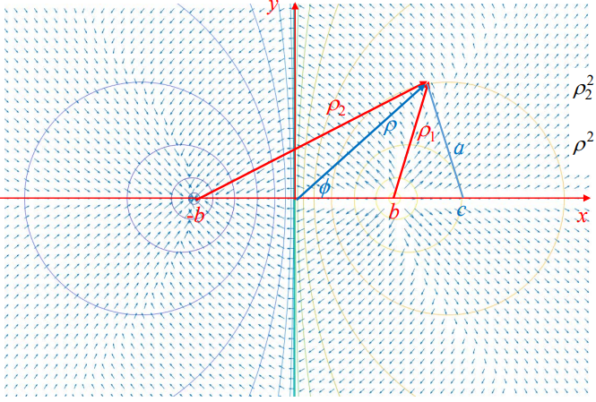
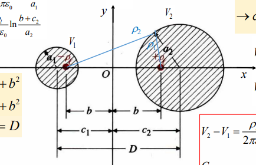
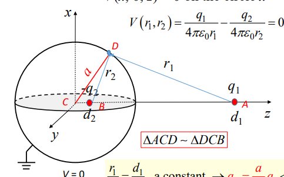

## Apollonian Circles

- https://en.wikipedia.org/wiki/Apollonian_circles

If you look at the blue circles, you would probably find that It's pretty similar to the figures on the handout.

Let's take a look on the definition of the first family of Apollonian circles

$$
\begin{gather}
\left\{X \big| \frac{d(X, C)}{d(X, D)}=r\right\}
\end{gather}
$$

It's not difficult to find it is actually the same.

It is the most important thing in Apollonian circles that it have a principle

> Every circles in the first family (blue circles) can be written as the linear combination of two different circles in the first family.

This Lemma is not hard to proof. By the definition above we have

$$
\begin{gather}
\frac{d(X, C)}{d(X, D)}=\frac{\sqrt{(x-C_x)^{2}+(y-C_y)^{2}}}{\sqrt{(x-D_x)^{2}+(y-D_y)^{2}}} = r
\\\\
\frac{(x-C_x)^{2}+(y-C_y)^{2}}{(x-D_x)^{2}+(y-D_y)^{2}} = r^{2}
\\\\
\bigg((x-C_x)^{2}+(y-C_y)^{2}\bigg) -r^{2}\bigg((x-D_x)^{2}+(y-D_y)^{2}\bigg)=0
\end{gather}
$$

for every circles in Apollonian circles family, we have the form of above formula. Namely, linear combination of two source point (in Electromagnetics usually line charges or point charges) can represent all of the circles.

note that these source points can  also be view as circles with $r=0$.

## Line Charge Problem

### Type 1

Given $\rho_2/\rho_1 = k$ and $b$

we can write the circle equation of the potential $V_o$ as

$$
\begin{gather}
\frac{d(X, -b)}{d(X, b)}=\frac{\rho_2}{\rho_1} = k
\\\\
\implies
((x+b)^{2}+y^{2}) - k^{2}\left((x-b)^{2}+y^{2}\right) =0
\\\\
(1-k^{2})x^{2}+(1-k^{2})y^{2}+2b(1+k^{2})x+(1-k^{2})b^{2}=0
\\\\
x^{2}+2b\frac{1+k^{2}}{1-k^{2}}x+y^{2} + b^{2}=0
\\\\
\left(x+b\frac{1+k^{2}}{1-k^{2}}\right)^{2}+y^{2}=\left(b\frac{1+k^{2}}{1-k^{2}}\right)^{2}-b^{2}
\\\\
\end{gather}
$$

$$
\implies \left\{
\begin{align}
c &= -b\frac{1+k^{2}}{1-k^{2}}
\\\\
a^{2} &= \left(b\frac{1+k^{2}}{1-k^{2}}\right)^{2}-b^{2} = c^{2}-b^{2}
\end{align}\right.
$$

---

### Type 2

Given $a_1, a_2, D$

simply assume two circles formula as

$$
\begin{gather}
(x+c_1)^{2} +y^{2} - a_1^{2} = 0
\\\\
(x-c_2)^{2} +y^{2} - a_2^{2} = 0
\end{gather}
$$

Lemma of Apollonian circles tell as that every circle in the first family can be written as the linear combination of these two circle.

$y$ axis, bisection(中垂線) of $q_1, q_2$ in this problem  is also included(circle that have $\infty$ radius).

$$
\begin{gather}
\bigg((x+c_1)^{2} +y^{2} - a_1^{2}\bigg) +m \bigg( (x-c_2)^{2} +y^{2} - a_2^{2}\bigg)= 0
\end{gather}
$$

and for the $y$ axis $x=0$, it's reasonable to guess $m=-1$

$$
\begin{gather}
\bigg((x+c_1)^{2} +y^{2} - a_1^{2}\bigg) - \bigg( (x-c_2)^{2} +y^{2} - a_2^{2}\bigg)= 0
\\\\
2(c_1+c_2)x +c_1^{2} -c_2^{2} -a_1^{2}+a_2^{2}=0
\\\\
\implies c_1^{2} -c_2^{2} -a_1^{2}+a_2^{2}=0
\\\\
\implies
(c_1+c_2)(c_1-c_2) = a_1^{2}-a_2^{2}
\\\\
\implies
c_1-c_2 = \frac{a_1^{2}-a_2^{2}}{D}
\end{gather}
$$

It's easy to solve $c_1, c_2$ now.

---

## Sphere Problem

for sphere problem, we commonly can get the relationship

$$
\begin{gather}
\frac{r_1}{r_2} = \frac{q_1}{q_2}
\end{gather}
$$

$q_1/q_2$ is definitely a constant. Thus it is an Apollonian circles problem again.

In this type of problem, usually given $a, d_1, q_1$

as the Lemma mentioned above we know that there exists a bisection(中垂線) of $q_1$ and $q_2$.

The bisection could be written as the linear combination of two circle equations, surface of sphere and the point $q_1$

$$
\begin{gather}
x^{2}+z^{2} - a^{2} = 0 
\\\\
x^{2} + (z-d_1)^{2} = 0
\\\\
\implies
\bigg(x^{2}+z^{2} - a^{2}\bigg) +m
\bigg( x^{2} + (z-d_1)^{2}\bigg) = 0
\end{gather}
$$

guess $m=-1$

$$
\begin{gather}
\bigg(x^{2}+z^{2} - a^{2}\bigg) -
\bigg( x^{2} + (z-d_1)^{2}\bigg) = 0
\\\\
2d_1z-a^{2}-d_1^{2} = 0
\\\\
z = \frac{a^{2}+d_1^{2}}{2d_1}
\end{gather}
$$

now we can fine $b$

$$
\begin{gather}
b = d_1 - \frac{a^{2}+d_1^{2}}{2d_1} = \frac{d_1^{2}-a^{2}}{2d_1}
\\\\
\implies
d_2= d_1-2b = d_1-\frac{d_1^{2}-a^{2}}{d_1} = \frac{a^{2}}{d_1}
\end{gather}
$$

and for the value of $r_1/r_2$ which is a **constant**.
Thus, simply take the point $A(0, 0, a)$ on the surface of sphere.

$$
\begin{gather}
k = \frac{r_1}{r_2} = \frac{d(A, q_1)}{d(A, q_2)} = \frac{d_1-a}{a-d_2} = \frac{d_1-a}{a-\frac{a^{2}}{d_1}} = \frac{d_1(1-\frac{a}{d_1})}{a(1-\frac{a}{d_1})} = \frac{d_1}{a}
\end{gather}
$$
