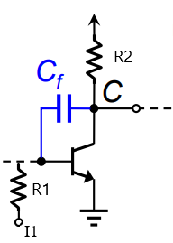

## Miller Compensation

 

$$
\begin{gather}
\frac{V_o}{I_i} = \frac{(sC_f - g_m)R_1 R_2}{1+sX(s) + s^{2}Y(s)}
\\\\
X(s) = R_1C_1 + R_2C_2 + R_1C_f(1+g_mR_2)+R_2C_f
\\\\
Y(s) = (C_1C_2 + C_1C_f + C_2C_f)\ R_1R_2 = \binom{\{C_1, C_2, C_f\}}{2}\cdot R_1R_2
\end{gather}
$$

- DC gain

$$
\begin{gather}
A_0 = A(0) = -g_mR_1R_2
\end{gather}
$$

- zero $z = g_m/C_f$
 
by definition, when

$$
\begin{gather}
A(s)\big|_{s=z} = A(z) = 0
\end{gather}
$$

implies there is no (AC)current go through $R_D$, thus we can easily have

$$
\begin{gather}
(V_i - V_o)sC_f= V_i\ g_m
\\\\
\implies sC_f=g_m
\end{gather}
$$

- poles
 
consider case without $C_f$
 

$$
\begin{gather}
1+sX_o(s)+s^{2}Y_o(s) = (1+sR_1C_1)(1+sR_2C_s)
\\\\
\implies \left\{
\begin{aligned}
X_o(s) &=R_1C_1 + R_2C_2
\\\\
Y_o(s) &= R_1R_2C_1C_2
\end{aligned}
\right.
\end{gather}
$$

now consider $C_f$

$$
\implies \left\{
\begin{aligned}
X(s) &= R_1C_1' + R_2C_2' = R_1(C_1 + C_{f-miller})+ R_2(C_2 +C_f)
\\\\
Y(s) &= (C_1C_2 + C_1C_f + C_2C_f)\ R_1R_2
\end{aligned}\right.
$$

---
### Pole Splitting

$$
\begin{gather}
D(s) = \left(1+\frac{s}{\omega_{p1}'}\right)\left(1+\frac{s}{\omega_{p2}'}\right)= 1+X(s)s+Y(s)s^{2} 
\end{gather}
$$

assume $\omega_{p1}'$ dominates ($\omega_{p1} \ll \omega_{p2}$), then

$$
\begin{gather}
D(s) \approx 1 + \frac{s}{\omega_{p1}} + \frac{s^{2}}{\omega_{p1}\omega_{p2}}
\\\\
\implies \left\{
\begin{aligned}
\omega_{p1} &= \frac{1}{R_1C_1 + R_2C_2 + R_1C_f(1+g_mR_2)+R_2C_f} \approx \frac{1}{g_mR_1R_2C_f}
\\\\
\omega_{p2} &= \frac{g_mC_f}{C_1C_2+C_1C_f+C_2C_f}
\end{aligned}\right.
\end{gather}
$$

