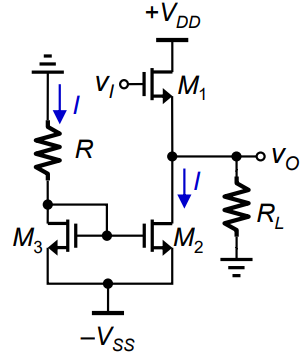
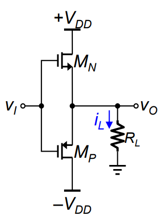
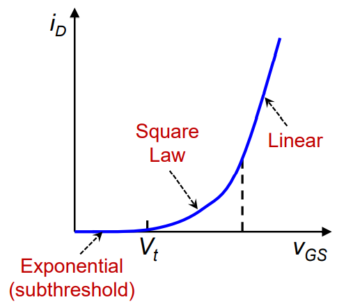
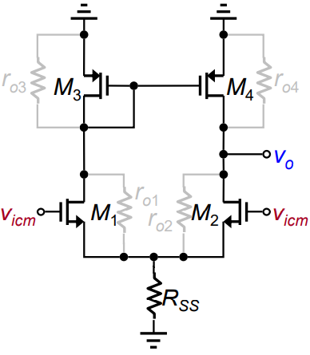
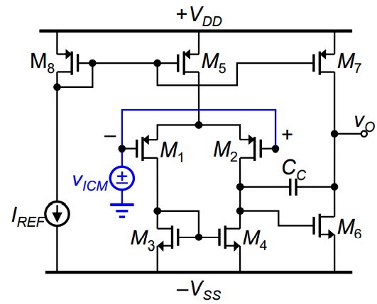
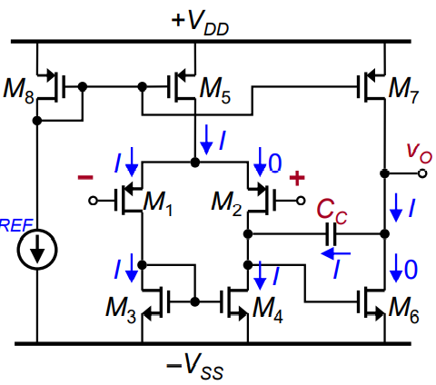
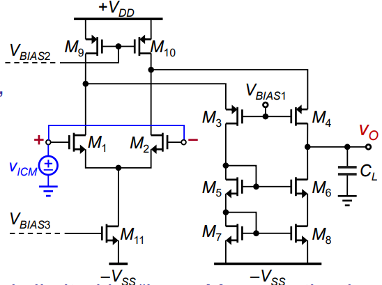

## Terminology

- **THD**: Total Harmonic Distortion

## Class A

- Power delivered to load ($P_L$)

$$
\begin{gather}
P_L=V_{O-rms}\cdot I_{L-rms}=\frac{1}{2}\frac{{V_{O-p}}^{2}}{R_L}
\end{gather}
$$

- Power drawn from supply ($P_S$)

$$
\begin{align}
P_S
&= (P \text{ from } M_1)+(P \text{ from } M_2)
\\\\
&=V_{DD}\overline {I_{D1}}+V_{SS}I_{D2}
\\\\
&= (V_{DD}+V_{SS})I
\end{align}
$$

???+ note "note"
    
    consider the original definition of (AC) power
    
    $$
    \begin{gather}
    P=\frac{1}{2\pi}\int_0^{2\pi}{v(t)i(t)\,dt}
    \end{gather}
    $$
    
    in the $P_L$ case, we have the vary $v_O$, thus we write
    
    $$
    \begin{gather}
    P_L=\frac{1}{2}V_pI_p\cos(\theta)=V_{rms}I_{rms}
    \end{gather}
    $$
    
    however, in the $P_S$ case, we have an constant source $V_{DD}$ and $V_{SS}$, thus
    
    $$
    \begin{align}
    P_S &= \frac{1}{2\pi}\int_0^{2\pi}{V\cdot i(t)\,dt}
    \\\\
    &= V\cdot \frac{1}{2\pi}\int_0^{2\pi}{i(t)\,dt}
    \\\\
    &= V\cdot I_{avg}
    \end{align}
    $$

## Class B

- Power delivered to load ($P_L$)

ignoring crossover distortion

$$
\begin{gather}
P_L=\frac{1}{2}\frac{{V_{O-p}}^{2}}{R_L}
\end{gather}
$$

- Power drawn from supply ($P_S$)

for each MOS, only conducting in half period

$$
\begin{align}
P_{Sn}=P_{Sp}&={V_{DD}\cdot \overline{I_D}}
\\\\
&= V_{DD}\cdot \frac{1}{2\pi}\int_0^{2\pi}{\frac{V_{O-p}}{R_L}\sin\theta \,d\theta}
\\\\
&= V_{DD}\cdot \frac{V_{O-p}}{\pi R_L}
\end{align}
$$

and for total power

$$
\begin{gather}
P_S=P_{Sp}+P_{Sn}=\frac{2}{\pi}\frac{V_{O-p}}{R_L}V_{DD}
\end{gather}
$$

- efficiency $\eta$

$$
\begin{gather}
\eta = \frac{P_L}{P_S}=\frac{\pi}{4}\frac{V_{o-p}}{V_{DD}}
\end{gather}
$$

- dissipated power $P_D$

$$
\begin{gather}
P_D = P_S - P_L = \frac{2}{\pi}\frac{V_{O-p}}{R_L}V_{DD} - \frac{1}{2}\frac{V_{O-p}^{2}}{R_L}
\end{gather}
$$

- $P_{D-max}$ w.r.t $V_{o-p}$

$$
\begin{gather}
\frac{d P_D}{d V_{o}}=\frac{2}{\pi}\frac{V_{DD}}{R_L}-\frac{V_o}{R_L}=0
\\\\
\implies V_o=\frac{2}{\pi}V_{DD}
\\\\
\implies
P_{D-max} = 2P_{Dn-max} = 2P_{Dp-max}=\frac{2V_{DD}^{2}}{\pi^{2}R_L}
\end{gather}
$$

## Class AB

### CS Buffer

- Output Resistance consider feedback (without $R_L$) $R_{out}$

$$
\begin{gather}
R_{out-p}=\frac{r_o}{1+\mu g_{mp}\,r_o} \approx \frac{1}{\mu g_{mp}}
\\\\
R_{out-n}=\frac{r_o}{1+\mu g_{mn}\,r_o} \approx \frac{1}{\mu g_{mn}}
\\\\
\implies
R_{out}= R_{out-p} || R_{out-n}=\frac{1}{\mu(g_{mp}+g_{mn})}
\end{gather}
$$

- Gain Error $G_E$

$$
\begin{gather}
G_E\equiv\frac{v_o-v_i}{v_i}=\frac{A}{1+A}-1=-\frac{1}{1+A}\approx \frac{-1}{A}=\frac{-1}{2\mu g_m R_L}
\end{gather}
$$

---

## Class D

- Theoretically power-conversion efficiency is $100\%$
 
since the input 1/0 pulse make transistors act as on-off switch, when the transistor on, there is no cross voltage, but current pass through. On the other hand, when transistor off, there is a large cross voltage but no current.

---
## Power MOSFET

- High $V_t$: $\quad 2V \sim 4V$
- In saturation region:
	- for low $V_{GS}$: &nbsp; $i_D \propto {V_{GS}}^{2}$
	- for high $V_{GS}$: &nbsp; $i_D \propto {V_{GS}}$
		- (the velocity saturation is due to the saturation of mobility $\mu$)

### Temperature Effects

$$
i_D=\frac{1}{2}\mu C_{ox} \frac{W}{L}(V_{GS}-V_t)^2
$$

for $T \uparrow$ $\implies$ $\mu\downarrow$, $V_T \downarrow$ 

- for low $V_{GS}$, $T \uparrow \implies i_D \uparrow$ &nbsp; ($\Delta\big[(V_{GS}-V_t)^2\big]$ dominates)

- for high $V_{GS}$, $T\uparrow \implies i_D \downarrow$ &nbsp; ($\Delta\big[\mu\big]$ dominates)

---

### Thermal Resistance

- Junction temp. $T_J$
- Ambient temp. $T_A$
- Thermal resistance between junction and ambience. $\theta_{JA}$

- Temperature here acts as voltage, and the dissipated power acts as current. Thus by Ohm's law we have

$$
\begin{gather}
T_{Jmax}-T_A=P_{Dmax}\,\theta_{JA}
\end{gather}
$$

---

## Two Stage CMOS op-amp
### Common-Mode

$$
\begin{gather}
A_{cm} \approx \frac{-1}{2g_{m3}\,R_{SS}}
\\\\
CMRR \equiv \frac{|A_d|}{|A_{cm}|}=g_{m1}(r_{o2}||r_{o4})\cdot 2g_{m3}R_{SS}
\end{gather}
$$

---
### Input Common-Mode Range

- lower limit ($M_1$ leaving saturation, when $V_{OV1} = V_{DS1}$)

$$
\begin{gather}
V_{ICM}+|V_{tp}| \geq V_{D3}=-V_{SS}+V_{GS3}
\\\\
V_{ICM} \geq -V_{SS}+V_{GS3}-|V_{tp}|
\end{gather}
$$

- upper limit ($M_5$ leaving saturation)

$$
\begin{gather}
V_{DD}-V_{OV5}  \geq V_{ICM} +V_{SG1}
\\\\
V_{ICM} \leq V_{DD}-V_{OV5} - V_{SG1}
\end{gather}
$$

### Output Swing

- lower limit

$$
\begin{gather}
v_O \leq -V_{SS}+V_{OV6}
\end{gather}
$$

- upper limit

$$
\begin{gather}
v_O \geq V_{DD}-V_{OV7}
\end{gather}
$$

---

### PSRR

!!! note "definition"
    
    $$
    \begin{gather}
    \text{PSRR}^{+} \equiv \frac{A_d}{A^{+}} & \text{where } A^{+}\equiv \frac{v_o}{v_{dd}}
    \\\\
    \text{PSRR}^{-} \equiv \frac{A_d}{A^{-}} & \text{where } A^{-}\equiv \frac{v_o}{v_{ss}}
    \end{gather}
    $$

- $\text{PSRR}^{+} \to \infty$ :
 
just remember that $v_O$ via second stage and $v_O$ via first stage would cancel out each other.

- $\text{PSRR}^{-}$
	- $v_O$ from first stage is $0$ (don't know fucking why) 
	- $v_O$ from second stage is

$$
\begin{gather}
v_o=v_{ss} \frac{r_{o7}}{r_{o7}+r_{o6}}
\\\\
\text{PSRR}^{-}= \frac{A_d}{A^{-}}=\frac{g_{m1}(r_{o2}||r_{o4})g_{m6}(r_{o6}||r_{o7})}{\frac{r_{o7}}{r_{o7}+r_{o6}}}
\end{gather}
$$

---

### Slew Rate

when $|v_{id}| > \sqrt2 V_{OV}$, the current would go through only one side of differential pair.

$$
\begin{gather}
v_o(t)=\frac{Q_C}{C_C}=\frac{I}{C_C}t
\\\\
\text{SR}=\frac{I}{C_C}=\frac{I}{G_{m1}/\omega_t}=\frac{I\omega_t}{I/V_{OV}}=\omega_tV_{OV}
\end{gather}
$$

---

## Folded-Cascode CMOS op-amp

### Input Common-Mode Range

- upper limit ($M_1, M_2$ leave saturation)

$$
\begin{gather}
V_{ICM}-V_{tn} \leq V_{DD}-V_{OV9}
\\\\
\implies
V_{ICM} \leq V_{DD}-V_{OV9}+V_{tn}
\end{gather}
$$

- lower limit ($M_{11}$ leaves saturation)

$$
\begin{gather}
V_{ICM}-V_{GS1} \geq -V_{SS} +V_{OV11}
\\\\
\implies
V_{ICM}\geq -V_{SS} +V_{OV11}+V_{GS1} 
\end{gather}
$$

### Output Swing

- upper limit ($M_4$ leaves saturation)

$$
\begin{gather}
v_O \leq V_{DD}-V_{OV10}-V_{OV4}
\end{gather}
$$

- lower limit ($M_6$ leaves saturation)

$$
\begin{gather}
v_O \geq -V_{SS}+V_{GS7}+V_{GS5}-V_{tn6}
\end{gather}
$$
