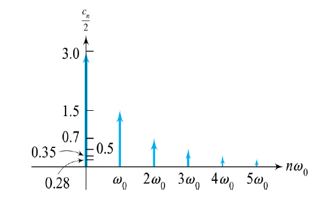

## Fourier Series

$$
f(x)=\frac{a_0}{2}+\sum_{n=1}^{\infty}{\bigg(a_n\cos{\frac{n\pi}{p}x}+b_n\sin{\frac{n\pi}{p}x}\bigg)}
$$

$$
\begin{align}
\\
a_0 = \frac{1}{p}\ \int_{P}{f(x)\ dx} \\\\
a_n = \frac{1}{p}\int_{P}{f(x)\cos{\frac{n\pi}{p}x}\ dx}\\\\
b_n = \frac{1}{p}\int_{P}{f(x)\sin{\frac{n\pi}{p}x}\ dx}\\\\
\end{align}
$$

in which $a_0,\ a_n,\ b_n$ are called as **Fourier coefficients**, $P$ is any of full period of $f(x)$.

Let $p$ always be a half of period, then we can understand that 

$$\frac{\pi}{p}=\frac{2\pi}{2p}=\omega_0$$

Notice that the close form of $a_n$ is often undefined on $0$.

$$
\begin{align}
\lim_{n\to 0}a_n\to\pm \infty
\end{align}
$$

---
## Fourier Cosine and Sine Series

1. $f(x)$ is even => Fourier cosine series
2. $f(x)$ is odd $\,$ => Fourier sine series

 

+ Tips

1. cosine & sine series : interval is change into $[-L,\ L]$, set $p=L$
2. Fourier series : interval $[-p,p]$ is change into $[0,L]$, set $p=L/2$ 
 
4. $p$ is always a half of period.

---

### Fourier Cosine Series

$$
\begin{align}
f(x)&=\frac{a_0}{2}+\sum_{n=1}^{\infty}{a_n\cos{\frac{n\pi}{p}x}}
\\\\
\end{align}
$$

in which, 

$$
\begin{align}
a_0 &= \frac{1}{p}\int_{-p}^{p}{f(x)\ dx}= \frac{\mathbf{2}}{p}\int_{\mathbf{0}}^p{f(x)\ dx}\\\\
a_n&=\frac{1}{p}\int_{-p}^{p}{f(x)\ \cos{\frac{n\pi}{p}}x\ dx}=\frac{\mathbf{2}}{p}\int_{\mathbf{0}}^p{f(x)\cos{\frac{n\pi}{p}x}\ dx}
\end{align}
$$

notice :
1. $f(x)$ is even.
2. Take $[-p, p]$ for $P$.
3. Half range extension (compare to Fourier series).

---

### Fourier Sine Series

$$
\begin{align}
f(x)=\sum_{n=1}^{\infty}{b_n\sin{\frac{n\pi}{p}x}}
\\\\
\end{align}
$$

in which, 

$$
\begin{align}
b_n=\frac{1}{p}\int_{-p}^p{f(x)\sin{\frac{n\pi}{p}x}\ dx}
=\frac{\mathbf{2}}{p}\int_{\mathbf{0}}^p{f(x)\sin{\frac{n\pi}{p}x}\ dx}
\end{align}
$$

notice :
1. $f(x)$ is odd. ($\big[f(x)  \sin\alpha x\big]$ will thus be even)
2. Take $[-p,p]$ for $P$
3. Half range extension (compare to Fourier series).

---

## Gibbs Phenomenon

$$
f(x)=\frac{a_0}{2}+\sum_{n=1}^{N}{\bigg(a_n\cos{\frac{n\pi}{p}x}+b_n\sin{\frac{n\pi}{p}x}\bigg)}
$$

There will be **"overshooting"** near discontinuities when $N$ isn't infinity.

While $N \to \infty$, "overshooting" will be more and more narrow.

And according to convergence theorem, for all $a$ in the domain of $f(x)$, we have

$$
\begin{align}
\lim_{n\to \infty}f(a)=\frac{1}{2}\big[f(a_-)+f(a_+)\big]
\end{align}
$$

---

## Phase Angle Form

+ Definition

$$
\begin{align}
f(x)=\frac{a_0}{2}+\sum_{n=1}^{\infty}{c_n\ \cos{(n\omega_0 x+\delta_n)}}
\end{align}
$$

in which

$$
\begin{align}
\omega_0 &= \frac{\pi}{p}\\\\
c_n&=\sqrt{a_n^2+b_n^2}\\\\
\delta_n&=\tan^{-1}{(\frac{-b_n}{a_n})}
\end{align}
$$

The phase angle form is aka **harmonic form**. 
$c_n$ is the $n$th harmonic amplitude, $\delta_n$ is the $n$th phase angle of $f(x)$, and the term $\cos{(n\omega_0 x+\delta_n)}$ is the $n$th harmonic of $f(x)$. ($n$階諧波)

---

### Amplitude Spectrum

Graph of the polar points $(\theta, r)= \bigg[(n\omega_0 , \frac{c_n}{2}) \ \cup\ (0, \frac{a_0}{2})\bigg]$ in which $n\omega_0$ is the frequency and $\frac{c_n}{2}$ is the amplitude.

---

## Complex Fourier Series
With Euler Formula 

$$e^{ix}=\cos{(x)}+i\ \sin{(x)}$$

, we can rewrite Fourier Series expansion as

$$
\begin{align}
f(x)&= d_0 + \sum_{n=1}^{\infty}{d_ne^{in\omega_0 x}}+ \sum_{n=1}^{\infty}{\overline{d_n}e^{-in\omega_0 x}}
\\\\
&=d_0+\sum_{n=-\infty,\ n\ne0}^{\infty}{d_ne^{in\omega_0 x}}
\end{align}
$$

in which, 

$$
\begin{align}
d_n=\frac{1}{2}(a_n-ib_n)=\frac{1}{2p}\int_{P}{f(t)e^{-in\omega_0 t}dt}
\end{align}
$$

notice that $p$ is also the half of period here, and that

$$
\begin{align}
\overline{d_n}=d_{-n}
\end{align}
$$

---

### Amplitude Spectrum

Graph of the polar points $(\theta, r)=(n\omega_0 , |d_n|)$, in which $n\omega_0$ is the frequency and $|d_n|$ is the amplitude.

