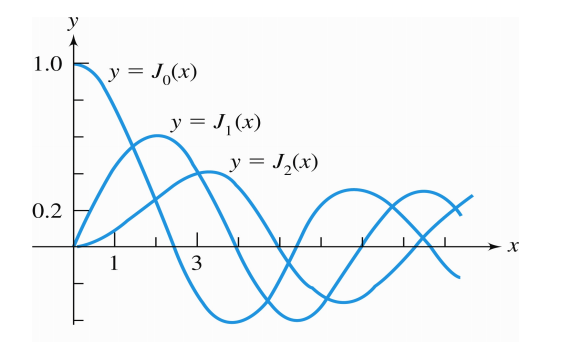
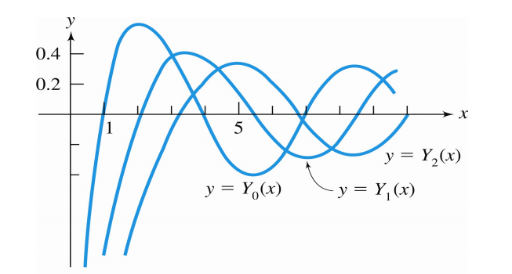

## Legendre Polynomials

$$
\begin{gather}
(1-x^2)y''-2xy'+\lambda y=0
\\\\
(1-x^2)y'' - 2xy' + n(n+1)y=0
\\\\
\big[(1-x^2)y'\big]+\lambda y = 0
\end{gather}
$$

solve the equation with $y = \sum a_m x^m$, we can get the conclusion that
$$
\begin{gather}
\lambda_{n} = n(n+1), \qquad \text{for } n = 0, 1,2 , \dots
\\\\
a_{m+2} = \frac{m(m+1)-\lambda_{n}}{(m+2)(m+1)}a_m
\end{gather}
$$

thus $a_{n+2} = a_{n+4} = \dots = 0$

---

### Normalization
- Let the polynomial $P_0(x)=1$, $P_1(x) = x$

- Recurrence relation : (背)
$$\begin{align}
(n+1)P_{n+1} = (2n+1)x P_n - nP_{n-1}
\end{align}
$$

---

### Fourier-Legendre Expansion

- $f(x)$ is  defined for $-1 < x< 1$

$$
\begin{gather}
f(x) = \sum_{n= 0}^{\infty}{c_{n}P_{n}(x)}
\\\\
c_{n} = \frac{(f, P_{n})}{(P_{n}, P_{n})} = \frac{\int_{-1}^{1}{f(x)}P_{n}(x)dx}{\int_{-1}^{1}{P^{2}_{n}(x)dx}}
\\\\
\int_{-1}^{1}{P^{2}_{n}(x)dx} = \frac{2}{2n+1}
\end{gather}
$$

---

## Bessel Functions
- definition
$$
\begin{align}
x^2y'' + xy' + (x^2 - \nu^2)y = 0
\end{align}
$$

- solution ( for $J_\nu$ and  $J_{-\nu}$ are independent)
	- $2\nu \notin ℕ$
	- $2\nu$ is odd positive integer

$$
\begin{gather}
y(x) = c_1 J_\nu(x) + c_2J_{-\nu}(x)
\end{gather}
$$

- solution ( for $J_\nu$ and  $J_{-\nu}$ are not independent)
	- $2\nu$ is even positive integer

$$
\begin{gather}
y(x) = c_1 J_\nu(x) + c_2Y_\nu(x)
\end{gather}
$$

- $J_\nu$ is called a Bessel function of the 1st kind of order $\nu$
$$
\begin{gather}
J_\nu = \sum_{n=0}^{\infty}{\frac{(-1)^n}{2^{n+\nu}n!\ \Gamma(n+\nu+1)}x^{2n+\nu}}
\end{gather}
$$

- $Y_\nu \rightarrow Y_{0}(0) = -\infty$

### Recurrence Relations
$$
\begin{gather}
\frac{d}{dx}(x^\nu J_\nu) = x^\nu J_{\nu-1}
\\\\
\frac{d}{dx}(x^{-\nu}J_\nu)=-x^{-\nu}J_{\nu+1}
\end{gather}
$$
---