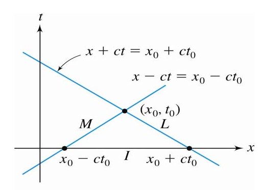

# Wave Equation
## 1-D Wave Equation

$$
\begin{gather}
y(x, t)
\\\\
\frac{\partial^2 y}{\partial t^{2}}=c^{2}\frac{\partial^2 y}{\partial x^{2}}
\end{gather}
$$

### Separate Variable Method

- 前提

wave equation is on a closed interval $[0, L]$

assume that 
$$
\begin{gather}
y(x, t) = X(x)T(t)
\end{gather}
$$

then

$$
\begin{gather}
X_{n}(x) = \sin{(\frac{n\pi x}{p})}

\\\\
T_{n}(x) = a_{n}\cos{(\frac{n\pi c}{p}t)}+b_{n}\sin{(\frac{n\pi c}{p}t)}
\end{gather}
$$

finally we have
$$
\begin{gather}
y(x, t) = \sum_{n=1}^{\infty}{y_{n}(x,t)} = \sum_{n =1}^{\infty}{X_{n}(x)\ T_n(t)}
\end{gather}
$$

---

#### zero initial velocity 
$$y_{t}(x, 0) = 0$$

let $f(x)$ be an initial displacement function

$$
\begin{gather}
f(x) = y(x, 0)
\end{gather}
$$

**then we can get**

$$
\begin{gather}
T_{n}(t) = a_{n} \cos{(\frac{n\pi c }{p}t)}
\end{gather}
$$

and finally, 

$$
\begin{gather}
y(x, t) = \sum_{n=1}^{\infty}{a_{n}\sin(\frac{n\pi x}{p})\cos{\frac{n\pi c}{p}t}}
\end{gather}
$$

- notice that p is a half of period ($[-p, p]$)

in which $a_{n}$ is the sine Fourier series coefficient of $f(x) = y(x, 0) = \sum{a_{n}\sin(\frac{n\pi x}{p})}$

$$
\begin{gather}
a_{n} = \frac{2}{p}\int_{0}^{p}{f(x)\sin{(\frac{n \pi x}{p})}dx}
\end{gather}
$$

---

#### zero initial displacement
$$y(x, 0) = 0$$

let $g(x)$ be the initial velocity function

$$
\begin{gather}
g(x) = y_{t}(x, 0)
\end{gather}
$$

then we can get
$$
\begin{gather}
T_{n}(t) = b_{n}\sin{(\frac{n\pi c}{p}t)}
\end{gather}
$$

in which $\frac{n\pi c}{p}b_{n}$ is the Fourier sine series coefficient of $g(x)$

$$
\begin{gather}
\frac{n \pi c }{p}b_{n} = \frac{2}{p}\int_{0}^{p}{g(x)\sin{(\frac{n \pi x}{p})}dx}
\end{gather}
$$

finally,

$$
\begin{align}
y(x, t) &= \sum_{n=1}^{\infty}{y_{n}(x, t) } 
\\\\
&=\sum_{n=1}^{\infty}{b_{n}\sin{(\frac{n\pi x}{p})}\sin{(\frac{n\pi c t}{p})}}

\end{align}
$$

---

#### nonzero initial velocity and displacement

in the situation, assume 
$$y(x, t) = y_{1}(x, t) + y_{2}(x, t)$$

which $y_{1}(x, t)$ assume zero initial velocity, and that $y_{2}(x, t)$ assume zero initial displacement

and that is same as what we have discussed above.

--- 

### with External Force

consider wave equation in this form

$$
\begin{gather}
\frac{\partial^2 y}{\partial t^{2}} = \frac{\partial^2 y}{\partial x^{2}}+Ax
\end{gather}
$$

$y(x, t)$ can not be separated. 

so we let
$$
\begin{gather}
y(x, t) = Y(x, t) + \phi(x)
\end{gather}
$$
assume that $Y(x, t)$ can be separated, which means we can get the answer with the [method](#Separate%20Variable%20Method) above.

代入 $y(x, t)$, we can get

$$
\begin{gather}
\frac{\partial^2 Y}{\partial t^{2}} = \frac{\partial^2 Y}{\partial t^{2}}+\frac{\partial^2 \phi}{\partial t^{2}}+Ax
\end{gather}
$$

therefore

$$
\begin{gather}
\phi''(x) + Ax =0
\end{gather}
$$

---

### Infinite Medium

for the wave equations which are define in $(-\infty, \infty)$

as usual, denote the initial displacement as $f(x)$ and the initial velocity as $g(x)$

first we have to know that the eigenvalue only exists when $\omega \geq 0$

- solve two ODE we can get
$$
\begin{gather}
X_{\omega}(x) = a_{\omega}\cos{(\omega x)}+ b_{\omega }\sin{(\omega x)}
\\\\
T_{\omega}(t) = A_{\omega}\cos{(\omega ct)} +  B_{\omega}\sin{(\omega ct)}
\end{gather}
$$

then the most important thing is that

$$
\begin{gather}
y(x, t) = \int_{0}^{\infty}{y_{\omega}(x, t) \ d\omega} = \int_{0}^{\infty}{X_{\omega}(x)T_{\omega}(t)\ d\omega  }
\end{gather}
$$

---
<!--
#### zero initial velocity
$$
\begin{gather}
T(t) = A_{\omega}\cos{(\omega ct)}
\end{gather}
$$

then we can get
$$
\begin{align}
y_{\omega}(x, t)&=X_{\omega}(x)T_{\omega}(x)
\\\\
&= \big(a_{\omega}\cos{(\omega x)}+b_{\omega}\sin{(\omega x)}\big)\cos{(\omega ct)}
\end{align}
$$

in which, 

$$
\begin{gather}
a_{\omega} = \frac{1}{\pi}\int_{-\infty}^{\infty}{f(x)\cos{(\omega x)}\ dx}
\\\\
b_{\omega} = \frac{1}{\pi}\int_{-\infty}^{\infty}{
f(x) \sin{(\omega x)}\ dx
}
\end{gather}
$$

---

#### zero initial displacement

$$
\begin{gather}
T(t) = B_{\omega}\sin{(\omega ct)}
\end{gather}
$$

then we can get
$$
\begin{align}
y_{\omega}(x, t)&=X_{\omega}(x)T_{\omega}(x)
\\\\
&= \big(a_{\omega}\cos{(\omega x)}+b_{\omega}\sin{(\omega x)}\big)\sin{(\omega ct)}
\end{align}
$$

in which, 

$$
\begin{gather}
a_{\omega} = \frac{1}{\omega c\pi}\int_{-\infty}^{\infty}{g(x)\cos{(\omega x)}\ dx}
\\\\
b_{\omega} = \frac{1}{\omega c \pi}\int_{-\infty}^{\infty}{
g(x) \sin{(\omega x)}\ dx
}
\end{gather}
$$
---
-->

### Semi-infinite Medium

for the wave equations which are define in $[0, \infty)$, thus

$$
\begin{gather}
y(0, t) = 0 \text{ for } t > 0
\end{gather}
$$

as usual, denote the initial displacement as $f(x)$ and the initial velocity as $g(x)$

$$
\begin{gather}
X(x) = a\cos{(\omega x)}+ b\sin{(\omega x)}
\\\\
T(t) = c_{\omega}\cos{(\omega ct)} + d_{\omega}\sin{(\omega ct)}
\end{gather}
$$

%%
since $X(0) = 0$, thus
$$
\begin{gather}
X(x) = b\sin{(\omega x)}
\end{gather}
$$
%%

---

### Finite V.S. Infinite Medium

|                      |              Finite              |               Infinite                |
|:--------------------:|:--------------------------------:|:-------------------------------------:|
|                      |       Fourier sine series        |           Fourier integral            |
|                      |         $\frac{n\pi}{p}$         |               $\omega$                |
|        $X(x)$        |    $\sin{(\frac{n\pi x}{p})}$    | $a\cos{(\omega x)}+b\sin{(\omega x)}$ |
| $T(t)$ when $v(0)=0$ | $a_{n}\cos{(\frac{n\pi c}{p}t)}$ |     $A_{\omega}\cos{(\omega ct)}$     |
| $T(t)$ when $d(0)=0$ | $b_{n}\sin{(\frac{n\pi c}{p}t)}$ | $B_{\omega}\sin{(\omega c t)}$                                      |

---

### Characteristics and d'Alembert's Solution

one special solution for these condition

$$
\begin{gather}
u_{tt} = c^{2}u_{xx} \quad -\infty < x < \infty, t > 0
\\\\
u(x, 0) = f(x) \quad -\infty < x < \infty
\\\\
u_{t}(x, 0) = g(x) \quad -\infty < x < \infty
\end{gather}
$$

**背**

$$
\begin{gather}
u(x, t) = \frac{1}{2}\big[f(x-ct) + f(x+ct)\big] + \frac{1}{2c} \int_{x-ct}^{x+ct} g(k) \ dk
\end{gather}
$$

---
### Forced Wave Motion

$$
\begin{gather}
\text{for  }\quad -\infty < x < \infty,\quad t > 0
\\\\
u_{tt} = c^{2}u_{xx}+F(x, t)
\\\\
u(x, 0) = f(x)
\\\\
u_{t}(x, 0) = g(x)
\end{gather}
$$

- solution

$$
\begin{gather}
u(x, t) = \frac{1}{2} \big[f(x-ct)+f(x+ct)\big]+\frac{1}{2c}\int_{x-ct}^{x+ct}{g(x)\ dx} + \frac{1}{2c}\iint_{\Delta}F(x, t)\ dx\ dt
\end{gather}
$$

$\Delta$ is characteristics triangle

$$
\begin{gather}
x-ct = k_{1}
\\\\
x+ct = k_{2}
\end{gather}
$$

$k_{1}$, $k_{2}$ can be any real constants.

---
## 2-D Wave Equation

$$
\begin{gather}
\frac{\partial z}{\partial t^{2}}=c^{2} \left(\frac{\partial^2 z}{\partial x^{2}}+\frac{\partial^2 z}{\partial y^{2}}\right)
\end{gather}
$$