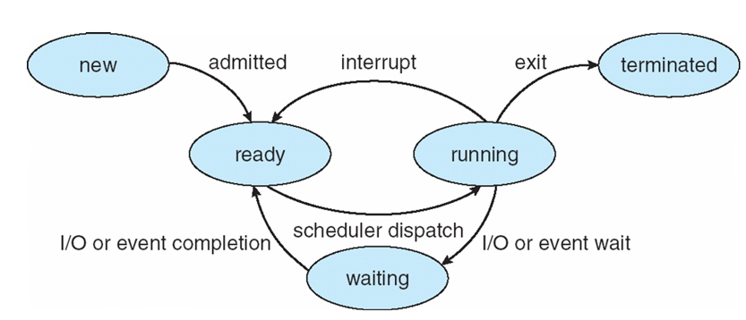

## Computer System Structure
+ Hardware
+ OS
+ Application
+ Users

---
## OS
- main proposes
	- resource allocator
	- resource manager
	- control program
	- interrupt driven

---
## System Call
- Purpose
	- interface of the service provided from OS

- types of system call
	- process control
	- file manipulation
	- device manipulation
	- information maintenance
	- communications
	- protection
 
---
## Interrupt
- hardware-generated change of flow within the system
- interrupt handler is called to deal with the cause of interrupt
---
## Single-Processor
+ **One general-propose CPU** - run all of the tasks including user's processes
- **One special-propose processor** - lies in most of single-processor system

## Multiprocessors

- Shares the computer bus and clock, memory, and peripheral devices.

- Aka 
	- parallel systems
	- tightly-coupled systems

 

- Pro 
	1. **Increased throughput** - speed up
	1. **Economy of scale** - cost less than N * single-processor systems
	1. **Increased reliability** - failure of one processor won't halt the system, only slow it down

### Asymmetric Multiprocessing
- Each processor is assigned a specie task
- The master processor schedules and allocates work to the slave processor

### Symmetric Multiprocessing
- Each processor performs all tasks
- All processors are peers; no master-slave relationship exists

### Uniform Memory Access
All of RAM takes the same amount of time to access.

### Non-uniform Memory Access
Some parts of memory may takes longer to access than other parts, creating a performance penalty.

### Multiprocessor System v.s. Clustered System 

- Multiprocessor System shares hardware, while clustered system have their own hardware for each computer.

- Multiprocessor System could communicate using shared memory, while clustered system using message.

- Clustered system requires stable and high speed network in order to synchronize

---

## Multi-programming System
- Maximize the use of CPU time so that CPU and I/O can be busy all the time.
- switch job basically due to waiting for I/O.
### Multi-tasking System
- aka time-sharing system
- a logical extension of multi-programming system
- switch among jobs so frequently that users can interact with each program while it's running

---

## Schedulers

### Short-term Scheduler
- aka CPU scheduler
- allocate one of the ready-to-execute processes to CPU
- invoked frequently (in ms)

### Long-term Scheduler
- aka job scheduler
- controls the degree of multiprogramming
- invoked infrequently (in sec, min)

### Mid-term Scheduler
- reduce the degree of multiprogramming
- **swapping** : remove process form memory, and store on disk, swap in to continue execution

---

##  Process State

- **new** : The process is being created
- **running** : Instruction are being executed
- **waiting** : The process is waiting for some event to occur
- **ready** : The process is waiting to be assigned to processor
- **terminated**: The process has finished execution

## Process Control Block
- Process state
- Program counter
- CPU registers
- CPU scheduling information
- Memory-management information
- Accounting information
- I/O status information

## Direct Memory Access
- Please explain why direct memory access (DMA) is considered an efficient mechanism for performing I/O. 
	- DMA is efficient for moving large amounts of data between I/O devices and main memory. It is considered efficient because it removes the CPU from being responsible for transferring data. DMA instructs the device controller to move data between the devices and main memory. 
	-  DMA 技術可以讓某些電腦內部組件直接讀寫記憶體而不需透過 CPU，如 此可 以降低 CPU 運算負擔，使整體系統運算速度加快。

## Layered Approach
- Simplicity of construction
- Simplifies debugging

## Micro-kernel System
- Minimize kernel
- Implement then as system and user-level **programs**

## Communication Models

### Shared Memory
- Pro - faster
- Con - have to ensure no writing to same place simultaneously

### Message Passing
- exchange messages via system call.
- Pros - useful for light data, no conflicts, easier to implement 
- Cons - slower

---