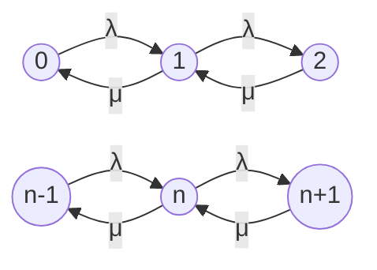

## Random Variable

- The result of experiments (random events)

## Markov's Inequality

- for $X \ge 0$ and $a > 0$

$$
\begin{gather}
P(X \ge a) \le \frac{E[X]}{a}
\end{gather}
$$

### Proof

Define a lower bound r.v. $Y$. That is

$$
Y=
\begin{dcases*}
a & if $X \ge a$
\\\\
0 & if $0< X < a$
\end{dcases*}
$$

thus, 

$$
\begin{gather}
Y \le X
\end{gather}
$$

then,

$$
\begin{gather}
E[X]\ge E[Y] = aP(X\ge a)
\\\\
\implies P(X\ge a) \le \frac{E[X]}{a}
\end{gather}
$$

## Chebyshev's Inequality

- for $X$ is r.v. having mean $\mu$ and variance $\sigma^{2}$, then for $k > 0$,

$$
\begin{gather}
P\big(|X-\mu| \ge k\sigma\big) \le \frac{1}{k^{2}}
\end{gather}
$$

### Proof

$$
\begin{gather}
P\big(|X-\mu|\ge k\sigma\big)=P\big((X-\mu)^{2}\ge k^{2}\sigma^{2}\big)
\end{gather}
$$

and by Markov's inequality, we now have,

$$
\begin{gather}
P\big(|X-\mu|\ge k\sigma\big)=P\big((X-\mu)^{2}\ge k^{2}\sigma^{2}\big) \le \frac{E\big[(X-\mu)^{2}\big]}{k^{2}\sigma^{2}}=\frac{1}{k^2}
\end{gather}
$$

---

## Law of Large Number

### Weak Law of Large Number

Let $\bar{X}=\frac{1}{n}\sum\limits{X_i}$, and $X_i$ are i.i.d., and for any $\epsilon > 0$

$$
\begin{gather}
P\bigg(|\bar X -\mu| \ge \epsilon\bigg) \to 0, \quad \text{when } n \to \infty
\end{gather}
$$

#### Proof

First of all,

$$
\begin{gather}
E[\bar X]=\mu
\\\\
\text{Var}(\bar X) = \frac{1}{n^{2}}\sum\limits_{i} \text{Var}(X_i) = \frac{\sigma^{2}}{n}
\end{gather}
$$

- since i.i.d., $\text{Cov}(X_i, X_j) = 0$

then by Chebyshev's inequality,

$$
\begin{gather}
P\bigg(|\bar X \ge \mu | \ge k \frac{\sigma}{\sqrt n}\bigg) \le \frac{1}{k^{2}}
\\\\
\implies
P\bigg(|\bar X \ge \mu | \ge \epsilon \bigg) \le \frac{\sigma^{2}}{n \epsilon ^{2}}
\end{gather}
$$

## Central Limit Theorem

- The sum of samples is also an normal distribution when $n\to \infty$.
- The sample mean is normal distributed.

Let $X_1, X_2, \dots$ be a sequence of i.i.d. random variables with mean $\mu$ and variance $\sigma^{2}$. Then,

$$
\begin{gather}
\lim_{n\to \infty} P\left(\frac{\sum\limits{X_i}- n\mu}{\sigma\sqrt{n}} < x\right)=\Phi(x)
\end{gather}
$$

in which $\Phi(x)$ is cdf of standard normal distribution.

## Monte Carlo Approach

$$
\begin{align}
\theta &= \int_0^{1}{g(x)dx}
\\\\
&= E\big[g(U)\big]
\\\\
&= \lim_{n\to \infty}{\frac{\sum\limits^{n} g(U_i)}{n}} 
\end{align}
$$

## Acceptance-Rejection Method

- required

$$
\begin{gather}
\frac{f(y)}{c\,g(y)} \le 1
\end{gather}
$$

To solve $c$, find the maximum of $\displaystyle {\frac{f(y)}{g(y)}}$. Then find $y^{*}$ such that

$$
\begin{gather}
y^{*} = \arg\max_y \frac{f(y)}{g(y)}
\\\\
c \ge \frac{f(y^{*})}{g(y^{*})} 
\end{gather}
$$

Normally, we hope $c$ as small as possible (to make the rejection rate lower). Thus we could let

$$
\begin{gather}
\boxed{
c=\frac{f(y^{*})}{g(y
^{*})}
}
\end{gather}
$$

???- example "Standard Normal R.V. Example"
    
    - **absolute** value of Z
    
    $$
    \begin{gather}
    f(x) = \frac{\mathbf 2}{\sqrt{2\pi}}e^{-x^{2}/2}
    \qquad 0 < x < \infty
    \end{gather}
    $$
    
    and let say $Y$ be exponential random variable with $\lambda = 1$
    
    $$
    \begin{gather}
    g(x) = e^{- x}
    \end{gather}
    $$
    
    then,
    
    $$
    \begin{gather}
    \frac{d}{dx}\frac{f(x)}{g(x)} = 0
    \\\\
    \implies
    \left(-x+1\right)\exp\left(-\frac{x^{2}}{2}+x\right) = 0
    \end{gather}
    $$
    
    thus
    
    $$
    \begin{gather}
    c =\frac{f(1)}{g(1)} = \frac{\sqrt {2e}}{\sqrt\pi}
    \end{gather}
    $$
    
    

---

## MM1 queue

First of all, with the entering rate $\lambda$ and exiting rate $\mu$, we have the server utilization $\rho$

$$
\begin{gather}
\rho = \frac{\lambda}{\mu}
\end{gather}
$$

and the server would be stable *iff* $\lambda < \mu$ so that the $\rho < 1$

The states transition graph have to follow the rule that the outgoing probability must be equal to ingoing probability. Thus it yields the following equations

$$
\left\{
\begin{gather}
\lambda p_0 =\mu p_1
\\\\
(\lambda +\mu) p_n = \lambda p_{n-1} + \mu p_{n+1}
\end{gather}\right.
$$

in which $n \in ℕ$, and then we can get $p_2$ as

$$
\begin{gather}
(\lambda + \mu) p_1 = \lambda p_0 + \mu p_2
\\\\
\implies
\lambda p_1 = \mu p_2
\end{gather}
$$

Recursively, we would have

$$
\begin{gather}
p_n = \rho \,p_{n-1}
\end{gather}
$$

and since we known that $\displaystyle {\sum\limits_i{p_i}=1}$,

$$
\begin{gather}
\sum\limits_i{p_i}=p_0\sum\limits_i{\rho^{i}}
=p_0\frac{1}{1-\rho} =1
\\\\
\implies p_0 = 1-\rho
\\\\
\implies p_n = (1-\rho)\rho^{n}
\end{gather}
$$

and thus we know that the stable state probability of number of customers $n$ waiting in queue is a geometric random variable with failure times $n$.

### Number of Customers in System

$$
\begin{align}
E[N] &= \sum\limits_n{n\cdot p_n} 
\\\\
&= (1-\rho)\sum\limits{n\rho^{n}}
\\\\
&= (1-\rho)\sum\limits_{i=0}^{\infty}\sum\limits_{j=i}^{\infty}{\rho^{j}}
\\\\
&= (1-\rho)\frac{\rho}{(1-\rho)^{2}}
\\\\
&\boxed{
= \frac{\rho}{1-\rho}
}
\end{align}
$$

### Average Departure Rate

$$
\begin{gather}
E[N_D] = \mu\rho = \lambda
\end{gather}
$$

### Waiting Time

- overall time spent in system $W$

$$
\begin{align}
E[W]
&=\frac{E[N]}{E[N_D]}
\\\\
&=\frac{E[N]}{\lambda}
\\\\
&=\frac{E[N]/\mu}{\rho}
\\\\
&\boxed{
=\frac{1}{\mu(1-\rho)}
}
\end{align}
$$

- time wait in queue $W_q$

$$
\begin{align}
E[W_q]
&=E[W]-\frac{1}{\mu}
\\\\
&=\frac{1}{\mu(1-\rho)}- \frac{(1-\rho)}{\mu(1-\rho)}
\\\\
&=\frac{\rho}{\mu(1-\rho)}
\end{align}
$$

---

## Sample Stats.

### Sample Mean

- denotation
    - $\theta$ &ndash; popluation mean
    - $\sigma^{2}$ &ndash; population variance
    - $\bar X$ &ndash; sample mean
    
$$
\begin{align}
\theta &= E[X_i]
\\\\
\sigma^{2} &= \text{Var}(X_i)
\\\\
\bar X &\equiv \sum\limits_{i=1}^{n}{\frac{X_i}{n}}
\\\\
E[\bar X] &= E \left[\sum\limits_{i=1}^{n}{\frac{X_i}{n}}\right]
\\\\
&= \frac{1}{n}E \left[\sum\limits_{i=1}^{n}{X_i}\right]
\\\\
&= \frac{1}{n}n\theta = \theta
\end{align}
$$

$$
\begin{align}
E\left[\left(\bar X - \theta\right)^{2}\right] &= \text{Var}(\bar X)
\\\\
&= \text{Var}\left(\sum\limits_{i=1}^{n}{\frac{X_i}{n}}\right)
\\\\
&= \frac{1}{n^{2}}\text{Var}\left(\sum\limits_{i=1}^{n}{X_i}\right)
\\\\
&= \frac{1}{n^{2}}n\sigma^{2} =\frac{\sigma^{2}}{n}
\end{align}
$$

---

## Binomial and Negative Binomial

### Binomial Distribution

- distribution of number of success $r$ given number of trails $n$

$$
\begin{gather}
P(X=r)=\binom{n}{r}p^{r}(1-p)^{n-r}
\end{gather}
$$

### Negative Binomial Distribution

- distribution of number of trails $n$ given number of success $r$
    - namely, distribution of number of failures $k$ given number of success $r$
    
$$
\begin{gather}
P(X=n)=\binom{n-1}{r-1}p^{r}(1-p)^{n-r}
\end{gather}
$$

## Geometric Distribution

- number of trails $n$ until success

$$
\begin{gather}
P(X=n)=p(1-p)^{n-1}
\end{gather}
$$

### Generation Method

- CMF

$$
\begin{gather}
F(i) = \sum\limits_{n=1}^{i}{p\,q^{n-1}}=p\,\frac{1-q^{i-1}}{1-q}=1-q^{i-1}
\end{gather}
$$

let

$$
\begin{gather}
U=G(i) = 1-F(i) = q^{i-1}
\end{gather}
$$

thus

$$
\begin{gather}
i-1 = \log_qU
\\\\
\implies
G^{-1}(U) = \lfloor {\log_{q}{U}} \rfloor + 1
\end{gather}
$$

## Poisson Distribution

- $\text{Pois}(\lambda)$
- Considering events occur with rate $r$, with time interval $t$, there would be average number of events $rt$ per interval.
	- say that $\lambda = rt$, expected rate of occurrences
	- Split the time interval $t$ in to $N$ pieces and make the sub-interval $t'$ very small(i.e. $N$ very large).
	- $t' = t/N \text{ where } N \to \infty\quad \text{then } \quad r\,t' \ll 1$ 
	- if $rt' \ll 1$, it approximates to do one Bernoulli trails in each time interval $t'$.
	- $\text{Pois}(\lambda) \equiv B(n=N,\, p=rt'=\lambda/N)\equiv B(n \to \infty, p \to 0)$
- $E_{X\sim Pois}\big[X\big] = \lambda = np = rt$
- $X \sim \text{Pois}(\lambda )$, indicates $X$ is the number of events occurs in **unit** time interval (and the event rate is $\lambda$).

$$
\begin{align}
P\{X=i\} &= \binom{n}{i}p^{i}\,(1-p)^{n-i}
\\\\
&= \binom{\cancel{n}}{i} \frac{\lambda ^{i}}{\cancel {n^{i}}}\,(1-p)^{n-i}
\\\\
&= \frac{\lambda^{i}}{i!}(1-p)^{n-i}
\\\\
&= \frac{\lambda^{i}}{i!}(e^{-p})^{n}
\\\\
&= \frac{\lambda^{i}}{i!}e^{-\lambda}
\end{align}
$$

!!! hint "hint"
    
    $$
    \begin{align}
    \lim_{x\to0}e^{x}=e^{0}\left(1+\frac{x}{1!}+\frac{x^{2}}{2!}\right)\approx1+x
    \end{align}
    $$
    

### Generation Method

1. Generate several exponential random variable $E_i \sim \text{Exp}(\lambda )$
2. until $E_1 +E_2 + \cdots + E_i \ge 1 >E_1 + E_2 + \cdots + E_{i-1}$

---

## Exponential Distribution

- time between events in Poisson process
- continuous analogue of the **geometric distribution**.

- **CDF**
    - take $Y \sim \text{Pois}(\lambda )$
    - split unit time interval to $1/N$, where $N$ is large
    - then $p=\lambda /N$
    
$$
\begin{gather}
P(X \ge k) = (1-p)^{kN} = e^{-kNp} = e^{-\lambda k}
\\\\
F(x) = 1-P(X\ge x) = 1- e^{-\lambda x}
\end{gather}
$$

- **PDF**

$$
\begin{gather}
f(x) = F'(x) = e^{-\lambda x}
\end{gather}
$$

### Generation Method

Since,

$$
\begin{gather}
F(x) = 1 - e^{-\lambda x }
\\\\
\implies
F^{-1}(U) = \frac{\ln (1-U)}{-\lambda}
\end{gather}
$$

identically,

$$
\begin{gather}
F^{-1}(U) = F^{-1}(1-U) = -\frac{1}{\lambda}\ln U
\end{gather}
$$

----
